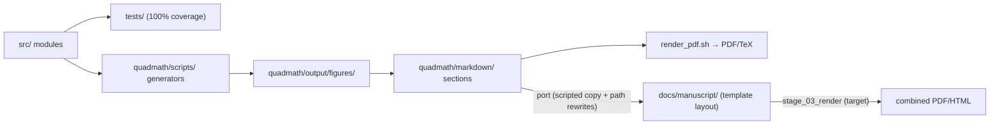

# QuadMath — repository overview

Analytical review of Quadray coordinates (Fuller.4D), integer volume
quantization on the IVM lattice, optimization on tetrahedral lattices, and
information geometry. Apache-2.0. Published v1 with DOI
[10.5281/zenodo.16887791](https://zenodo.org/records/16887791).

## Tour

| Path | Contents |
|---|---|
| `src/` | Python modules: `quadray.py` (coordinates, Ace 5×5 volume), `linalg_utils.py` (Bareiss determinant), `cayley_menger.py` (length-based volumes), `conversions.py` (embeddings), `nelder_mead_quadray.py` + `discrete_variational.py` (optimizers), `information.py` (Fisher/free energy), `ivm_field.py` (lattice field learning), `ivm_dynamics.py` (field dynamics/coupling ID), `learning_eval.py` (evaluation methodology) + `vis_lattice.py` (gallery rendering — see `docs/learning/`), `lattice_search.py`, `omni_numbering.py` (omnidirectional numbering), `visualize.py`, `examples.py`, `symbolic.py`, `glossary_gen.py`, plus AGENTS/README |
| `tests/` | Mirror tree; 100% coverage required for `src/` (see `docs/development/`) |
| `quadmath/markdown/` | Manuscript source of truth: `00_preamble.md` + sections `01_introduction.md` … `16_lattice_gallery.md` |
| `quadmath/scripts/` | Figure generators, `render_pdf.sh`, `clean_output.sh`, `validate_markdown.py` |
| `quadmath/output/` | Generated artifacts (figures, PDFs, TeX, CSV/NPZ) — regeneratable, do not hand-edit |
| `docs/manuscript/` | Template-layout manuscript projection (`config.yaml`, `preamble.md`, `references.bib`, sections `01–99`, `figures/`) |
| `docs/development/` | Test/coverage workflow + link checker |
| `docs/learning/` | Docs for the IVM learning surface: `ivm_field`, `ivm_dynamics`, `learning_eval`, `vis_lattice` |
| `docs/lean/` | Lean 4 formalization (core Lean 4; one open shell-count theorem) |
| `run_all.sh` | Full build entry point (tests → figures → PDFs) |
| `WORKFLOW.md`, `ARCHITECTURE.md` | Root-level build-pipeline and layout docs |

## Document flow

## Reading order for new contributors

1. Root `README.md` and `AGENTS.md` (conventions, quality gates)
2. `docs/overview.md` (this file)
3. `docs/development/README.md` (how to run tests/coverage)
4. `docs/manuscript/README.md` (manuscript layout + render parity)
5. `WORKFLOW.md` (test-driven development workflow details)
