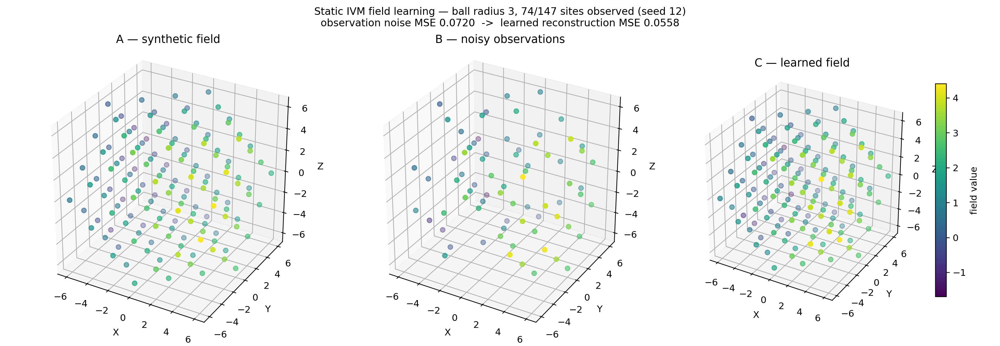

# Static IVM Field Learning

## Overview

This section develops machine learning on a static synergetic geometry: scalar
fields defined over the Isotropic Vector Matrix (IVM) lattice, learned from
sparse noisy observations by Laplacian-regularized kernel-weighted least
squares on the lattice graph. All methods live in the `ivm_field.py` module
(`quadray.IVMField`, `quadray_shell_norm`, `shell_sites`, `fit_geometry`) and
reuse the quadray machinery of `quadray.py` described in
[Quadray Methods](03_quadray_methods.md). The learner uses `numpy` only — no
machine-learning frameworks — and is fully deterministic for a fixed
observation set.

## The IVM Lattice in Quadray Coordinates

Quadray coordinates represent IVM close-packed sphere centers as non-negative
integer quadrays normalized so the minimum component is zero (see
[Quadray Methods](03_quadray_methods.md)). Two facts organize the lattice.
First, normalization adds or subtracts $(k,k,k,k)$, so the component sum is a
projective invariant modulo 4. Second, the IVM sites are exactly one of the
four residue classes:

\begin{equation}
\label{eq:ivm-site-condition}
q \text{ is an IVM site} \quad\Longleftrightarrow\quad \textstyle\sum_i q_i \equiv 0 \pmod{4},
\end{equation}

implemented as `is_ivm_site()` in `ivm_field.py`. The remaining three cosets
are the octahedral (sum $\equiv 2$) and tetrahedral (sum $\equiv 1, 3$) voids
of the packing — lattice points of the ambient grid, but not sphere centers.

The shell norm of a site is the $L^1$ magnitude of its sum-zero
(Coxeter.4D hyperplane) representative. With $s = \sum_i q_i$:

\begin{equation}
\label{eq:ivm-shell-norm}
N(q) \;=\; \sum_{i=1}^{4} \left|\, q_i - \tfrac{s}{4} \,\right| \;=\; 2k, \qquad k \in \mathbb{Z}_{\geq 0},
\end{equation}

computed by `quadray_shell_norm()`. Shell $k$ of the lattice is the set of
sites with $N(q) = 2k$; `shell_sites(k)` enumerates it by scanning the
bounding box $[0, 2k]^4$, filtering on the membership condition
\eqref{eq:ivm-site-condition} and the norm \eqref{eq:ivm-shell-norm}, and
sorting lexicographically — a deterministic site order. The shell
cardinalities are the cuboctahedral numbers:

\begin{equation}
\label{eq:ivm-shell-cardinality}
\bigl|\, \{ q : N(q) = 2k \} \,\bigr| \;=\; 10k^2 + 2, \qquad k \geq 1,
\end{equation}

giving the sequence 1, 12, 42, 92, 162, ... for $k = 0, 1, 2, 3, 4$ — the
center plus the cuboctahedral numbers, with shell 1 the twelve-around-one
vector equilibrium of [Quadray Methods](03_quadray_methods.md).
`shell_cardinalities()` counts shells of an enumerated ball, and the test
suite pins the sequence exactly.

## The Field Model

`IVMField.lattice_ball(radius)` stores a scalar field over the lattice ball
$B_R = \{ q : N(q) \leq 2R \}$ as a one-dimensional `numpy` array keyed by
the deterministic site index of `ball_sites()` (shell-major, lexicographic
within shell), with a dictionary mapping each normalized site to its array
position. Two lattice-graph ingredients drive learning. The adjacency
structure uses the twelve IVM neighbor moves — the permutations of
$(2,1,1,0)$ collected in `IVM_NEIGHBOR_STEPS` — so two sites in the ball are
graph-adjacent exactly when one step of close packing separates them. The
graph Laplacian $L$ (method `IVMField._laplacian()`) is the symmetric
difference operator on that adjacency:

\begin{equation}
\label{eq:ivm-laplacian}
(L f)_i \;=\; \deg(i)\, f_i \;-\; \sum_{j \sim i} f_j .
\end{equation}

## Learning: Laplacian-Regularized Kernel-Weighted Least Squares

Observations $y_j$ arrive at a sampled subset $\Omega$ of sites. Graph
distances $d(\cdot,\cdot)$ are hop counts from a multi-source BFS
(`_multi_source_distances()` in `ivm_field.py`), and the Gaussian kernel over
hops with width $\tau$ (`kernel_width`) is:

\begin{equation}
\label{eq:ivm-kernel}
K(d) \;=\; \exp\!\bigl( -(d/\tau)^2 \bigr), \qquad d(i,j) = \text{hop distance}.
\end{equation}

`IVMField.learn()` minimizes a two-regime objective over the ball:

\begin{equation}
\label{eq:ivm-objective}
\min_{f} \;\; \sum_{i \in \Omega} \bigl( f_i - y_i \bigr)^2
\;+\; \sum_{i \notin \Omega} c_i \bigl( f_i - t_i \bigr)^2
\;+\; \lambda \sum_{i \sim j} \bigl( f_i - f_j \bigr)^2 ,
\end{equation}

with three data-fidelity terms: observed sites are pinned to their data with
unit weight (no self-smoothing of real observations); unobserved sites carry
a kernel confidence weight and a Nadaraya–Watson kernel target,

\begin{equation}
\label{eq:ivm-confidence}
c_i \;=\; \max\bigl( K\bigl(\min_{j \in \Omega} d(i,j)\bigr),\ \varepsilon \bigr),
\qquad
t_i \;=\; \frac{\sum_{j \in \Omega} K(d(i,j))\, y_j}{\sum_{j \in \Omega} K(d(i,j))},
\end{equation}

where $\varepsilon$ is a numerical floor keeping the system positive
definite. The normal equations of \eqref{eq:ivm-objective} are

\begin{equation}
\label{eq:ivm-normal-equations}
\bigl( C + \lambda L \bigr) f \;=\; C\, t ,
\end{equation}

with $C = \mathrm{diag}(c_i)$ and $t$ the target vector; `IVMField.learn()`
solves them with a dense `numpy.linalg.solve`. The Laplacian term propagates
field structure from observed sites across the lattice graph, and the
confidence weighting degrades gracefully to pure Laplacian propagation as
observation density falls. Because observed rows carry unit weight, the
estimator interpolates exact data as $\lambda \to 0$ and denoises noisy data
for moderate $\lambda$ — both behaviors are verified numerically in
`tests/test_ivm_field.py` with fixed seeds.

Two structural facts justify the estimator. A linear field in the embedded
XYZ coordinates (the `to_xyz()` image of `quadray.py`) is harmonic on the
IVM graph — the twelve neighbor moves sum to zero — so the harmonic
extension implied by \eqref{eq:ivm-normal-equations} reproduces it exactly
from boundary data (asserted to $10^{-5}$ in the test suite). And for noisy
smooth fields, the learned field tracks the kernel-weighted local mean,
which averages observation noise across graph neighborhoods:

\begin{equation}
\label{eq:ivm-mse}
\mathrm{MSE}(f) \;=\; \frac{1}{|B_R|} \sum_{i \in B_R} \bigl( f_i - f_i^{\text{truth}} \bigr)^2 ,
\end{equation}

the quantity returned by `IVMField.score()`.

## Recovering Tetrahedral Geometry from Noisy Points

`fit_geometry()` recovers the orientation and scale of a tetrahedron from
noisy 3D point clouds, using the quadray basis of `quadray.py`. The four
canonical vertices are the images $t_i = \texttt{to\_xyz}(e_i)$ of the unit
quadray axes $e_i$ under the embedding matrix (columns of the 3$\times$4
basis image). Given labeled observations $p^{(i)}_m \approx R\, t_i + o$
(noisy samples of vertex $i$), vertex centroids $c_i$ are formed and the
linear map $G$ is fit in closed form:

\begin{equation}
\label{eq:ivm-fit}
G \;=\; \arg\min_{M \in \mathbb{R}^{3\times 3}} \sum_{i=1}^{4}
\bigl\| M t_i - c_i \bigr\|^2 ,
\qquad
\text{scale} \;=\; \operatorname{sign}\bigl(\det G\bigr)\, \bigl|\det G\bigr|^{1/3}.
\end{equation}

The least-squares solve uses `numpy.linalg.lstsq` on the transpose system,
so noisy multi-sample vertices average out; the residual reported by
`TetrahedronFit.residual` is the RMS vertex-centroid mismatch. The test
suite recovers a rotated, scaled tetrahedron to $10^{-6}$ from $\sigma =
10^{-7}$ noise, verifies the signed scale for reflected (negative
determinant) fits, and checks that doubling the embedding halves the
recovered matrix — orientation and scale separate cleanly.

## Demonstration

The script `quadmath/scripts/ivm_field_demo.py` (run with `MPLBACKEND=Agg`,
seed 12) renders the pipeline on the radius-3 ball: the synthetic field
(a harmonic linear part plus a weak quadratic bowl), the noisy observations
at half the sites, and the learned field. The learned reconstruction beats
the raw observation noise:

## Cross-References

- Coordinate foundations and the twelve-around-one shell: [Quadray Methods](03_quadray_methods.md)
- Optimization methods on tetrahedral lattices: [Optimization in 4D](04_optimization_in_4d.md)
- Applications and generalizations: [Extensions](05_extensions.md)
