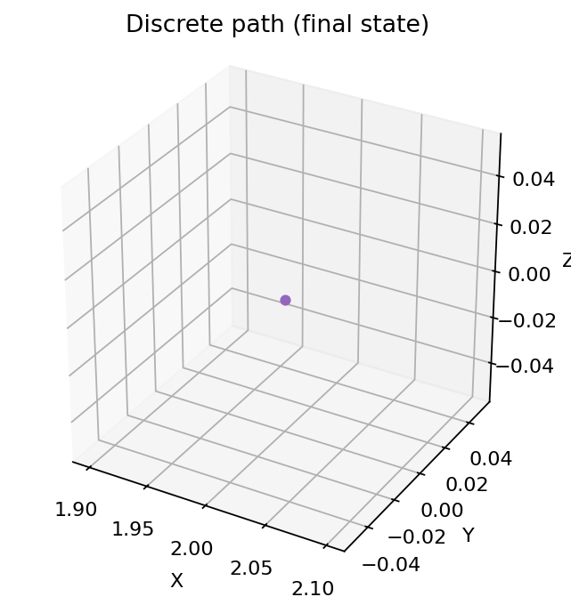

# QuadMath: An Analytical Review of 4D and Quadray Coordinates

## Abstract

We review a unified analytical framework for four dimensional (4D) modeling and Quadray coordinates, synthesizing geometric foundations, optimization on tetrahedral lattices, and information geometry. Building on R. Buckminster Fuller's synergetics [Synergetics (Fuller)](https://en.wikipedia.org/wiki/Synergetics_(Fuller)) and the Quadray coordinate system, with extensive reference to Kirby Urner's computational implementations across multiple programming languages (see the comprehensive [4dsolutions ecosystem](https://github.com/4dsolutions) including Python, Rust, Clojure, and POV-Ray implementations), we review how integer lattice constraints yield integer volume quantization of tetrahedral simplexes, creating discrete "energy levels" that regularize optimization and enable integer-based optimization. We adapt standard methods (e.g., [Nelder–Mead method](https://en.wikipedia.org/wiki/Nelder%E2%80%93Mead_method)) to the quadray lattice, define [Fisher information](https://en.wikipedia.org/wiki/Fisher_information) in Quadray parameter space, and analyze optimization as geodesic motion on an information manifold via the [natural gradient](https://en.wikipedia.org/wiki/Natural_gradient). We also integrate 4D namespaces (Quadray, Extended Euclidean, relativistic Einsteinian spaces), develop analytical tools and equations, and survey extensions and applications across AI, [active inference](https://welcome.activeinference.institute/), cognitive security, and complex systems. The result is a cohesive, interpretable approach for robust, geometry-grounded computation in 4D.

Keywords: Quadray coordinates, 4D geometry, tetrahedral lattice, integer volume quantization, information geometry, optimization, synergetics, active inference.

## Manuscript structure

- Introduction: motivates Quadrays, clarifies 4D namespaces (Coxeter.4D, Einstein.4D, Fuller.4D), and summarizes contributions.
- Methods: details coordinate conventions, exact tetravolumes, conversions, and lattice-aware optimization methods (Nelder–Mead and discrete IVM descent).
- Results: empirical comparisons and demonstrations are shown inline and saved under `quadmath/output/` (PNG/CSV/NPZ/MP4) for reproducibility.
- Discussion: interprets results, limitations, and implications; outlines future work.
- Appendices: equations, free-energy background, and a consolidated symbols/glossary with an auto-generated API index.

## Reproducibility and data availability

- The manuscript Markdown and code to generate the PDF are available on the project repository (`QuadMath` on GitHub, @docxology username). See the repository home page for source, figures, and scripts: [QuadMath repository](https://github.com/docxology/quadmath).
- The manuscript is licensed under the Apache License 2.0. See the [LICENSE](../LICENSE) file for details.
- The manuscript is accompanied by a fully-tested Python codebase under `src/` with unit tests under `tests/`, complemented by extensive cross-validation against Kirby Urner's reference implementations in the [4dsolutions ecosystem](https://github.com/4dsolutions).
- All figures referenced in the manuscript are generated by scripts under `quadmath/scripts/` and saved to `quadmath/output/` with lightweight CSV/NPZ alongside images.
- Tests accompany all methods under `src/` and enforce 100% coverage for `src/`; external validation includes comparisons with [`qrays.py`](https://github.com/4dsolutions/m4w/blob/main/qrays.py) and [`tetravolume.py`](https://github.com/4dsolutions/m4w/blob/main/tetravolume.py) algorithms.
- Symbols and notation are standardized across sections; see Appendix: Symbols and Glossary for a consolidated table of variables and constants used throughout. Equation labels (e.g., Eq. \eqref{eq:lattice_det} and Eq. \eqref{eq:supp_fim}) and figure labels (e.g., Fig. \ref{fig:volumes_scale}) are used consistently.


# Introduction

Quadray coordinates provide a tetrahedral basis for modeling space and computation, standing in contrast to Cartesian frameworks. Originating in Buckminster Fuller's Synergetics, quadray coordinates enable the replacement of right-angle assumptions, with 60-degree coordination and a unit tetrahedron of volume 1. This reframing yields striking integer relationships among common polyhedra and provides a natural account of space via close-packed spheres and the isotropic vector matrix (IVM).

In this synthetic review, we distinguish three internal meanings of “4D,” following a dot-notation that avoids cross-domain confusion:

- Coxeter.4D — four-dimensional Euclidean space (E⁴), as in classical polytope theory. Coxeter emphasizes that Euclidean 4D is not spacetime; see the Dover edition of Regular Polytopes (p. 119) for a clear statement to this effect; background on lattice packings in four dimensions aligns with the treatment in Conway & Sloane’s [Sphere Packings, Lattices and Groups (Springer)](https://link.springer.com/book/10.1007/978-1-4757-6568-7).
- Einstein.4D — Minkowski spacetime (3D + time) with an indefinite metric; appropriate for relativistic physics but distinct from Euclidean E⁴.
- Fuller.4D — synergetics’ tetrahedral accounting of space using Quadrays (four non-negative coordinates with at least one zero after normalization) and the IVM = CCP = FCC correspondence. This treats the regular tetrahedron as a natural unit container and emphasizes angle/shape relations independent of time/energy.

Kirby Urner's expositions and implementations have been influential in making Quadray coordinates practical and accessible across multiple programming languages and educational contexts. See the comprehensive [4dsolutions ecosystem](https://github.com/4dsolutions):

- **Foundational materials**: [Urner – Quadray intro](https://www.grunch.net/synergetics/quadintro.html), [Quadrays and XYZ](https://www.grunch.net/synergetics/quadxyz.html), [Quadrays and the Philosophy of Mathematics](https://www.grunch.net/synergetics/quadphil.html)
- **Python implementations**: Core modules [`qrays.py`](https://github.com/4dsolutions/m4w/blob/main/qrays.py) (Quadray vectors with SymPy support) and [`tetravolume.py`](https://github.com/4dsolutions/m4w/blob/main/tetravolume.py) (IVM volumes, BEAST modules)
- **Educational notebooks**: [School_of_Tomorrow](https://github.com/4dsolutions/School_of_Tomorrow) including [Qvolume.ipynb](https://github.com/4dsolutions/School_of_Tomorrow/blob/master/Qvolume.ipynb) (Tom Ace 5×5) and [VolumeTalk.ipynb](https://github.com/4dsolutions/School_of_Tomorrow/blob/master/VolumeTalk.ipynb) (bridging vs native)
- **Cross-language validation**: [Rust implementation](https://github.com/4dsolutions/rusty_rays), [Clojure functional approach](https://github.com/4dsolutions/synmods), [VPython visualizations](https://github.com/4dsolutions/BookCovers)
- **Historical context**: [Python edu-sig post (May 2000)](https://mail.python.org/pipermail/edu-sig/2000-May/000498.html)

This paper unifies three threads:

- **Foundations**: Quadray coordinates and their relation to 4D modeling more generally, with explicit namespace usage (Coxeter.4D, Einstein.4D, Fuller.4D) to maintain clarity.
- **Optimization framework**: leverages integer volume quantization on tetrahedral lattices to achieve robust, discrete convergence.
- **Information geometry**: tools (e.g., Fisher Information, free-energy minimization) for interpreting optimization as geodesic motion on statistical manifolds.

Contributions:

- **Namespaces mapping**: Coxeter.4D (Euclidean E⁴), Einstein.4D (Minkowski spacetime), and Fuller.4D (Quadrays/IVM) → analytical tools and examples.
- **Quadray-adapted Nelder–Mead**: integer-lattice normalization and volume-level tracking.
- **Equations and methods**: comprehensive supplement with guidance for high-precision computation using `libquadmath`.
- **Discrete optimizer**: integer-valued variational descent over the IVM (`discrete_ivm_descent`) with animation tooling, connecting lattice geometry to information-theoretic objectives.

## Related work and background

- **Tetrahedron volume formulas**: length-based [Cayley–Menger determinant](https://en.wikipedia.org/wiki/Cayley%E2%80%93Menger_determinant) and determinant-based expressions on vertex coordinates (see [Tetrahedron – volume](https://en.wikipedia.org/wiki/Tetrahedron#Volume)).
- **Exact determinants**: [Bareiss algorithm](https://en.wikipedia.org/wiki/Bareiss_algorithm), used in our integer tetravolume implementations.
- **Information geometry**: [Fisher information](https://en.wikipedia.org/wiki/Fisher_information) and [natural gradient](https://en.wikipedia.org/wiki/Natural_gradient).
- **Optimization baseline**: the [Nelder–Mead method](https://en.wikipedia.org/wiki/Nelder%E2%80%93Mead_method), adapted here to the Quadray lattice.
- **4dsolutions ecosystem (comprehensive implementation suite)**: The [4dsolutions organization](https://github.com/4dsolutions) provides extensive computational resources for Quadrays and synergetic geometry:
  - **Primary Python modules**: [`qrays.py`](https://github.com/4dsolutions/m4w/blob/main/qrays.py) (Quadray vector operations, normalization, XYZ bridging) and [`tetravolume.py`](https://github.com/4dsolutions/m4w/blob/main/tetravolume.py) (IVM volumes, BEAST modules, multiple algorithms)
  - **Educational framework**: [School_of_Tomorrow](https://github.com/4dsolutions/School_of_Tomorrow) with interactive tutorials and algorithm comparisons in [Qvolume.ipynb](https://github.com/4dsolutions/School_of_Tomorrow/blob/master/Qvolume.ipynb) and [VolumeTalk.ipynb](https://github.com/4dsolutions/School_of_Tomorrow/blob/master/VolumeTalk.ipynb)
  - **Cross-platform validation**: Independent implementations in [Rust](https://github.com/4dsolutions/rusty_rays), [Clojure](https://github.com/4dsolutions/synmods), POV-Ray pipelines ([quadcraft.py](https://github.com/4dsolutions/School_of_Tomorrow/blob/master/quadcraft.py)), and [VPython animations](https://github.com/4dsolutions/BookCovers)
- **Related work**: [QuadCraft](https://github.com/docxology/quadcraft/) is a tetrahedral voxel engine game using Quadray coordinates.

Ecosystem context: The 4dsolutions organization spans 29+ repositories with implementations across Python, Rust, Clojure, POV-Ray, and VPython, providing extensive cross-language validation and educational resources. Core algorithmic modules include vector operations, volume calculations, visualization pipelines, and pedagogical frameworks that complement and validate the methods developed in this manuscript. See the comprehensive catalog in `07_resources.md`.

## Companion code and tests

The manuscript is accompanied by a fully-tested Python codebase under `src/` with unit tests under `tests/`. Key artifacts used throughout the paper:

- **Quadray APIs**: `src/quadray.py` (`Quadray`, `integer_tetra_volume`, `ace_tetravolume_5x5`).
- **Determinant utilities**: `src/linalg_utils.py` (`bareiss_determinant_int`).
- **Length-based volume**: `src/cayley_menger.py` (`tetra_volume_cayley_menger`, `ivm_tetra_volume_cayley_menger`).
- **XYZ conversion**: `src/conversions.py` (`urner_embedding`, `quadray_to_xyz`).
- **Examples**: `src/examples.py` (`example_ivm_neighbors`, `example_volume`, `example_optimize`).

Fig. \ref{fig:graphical_abstract} (graphical abstract): Panel A shows Quadray axes (A,B,C,D) under a symmetric embedding with wireframe context. Panel B shows close-packed spheres at the tetrahedron vertices (IVM/CCP/FCC, “twelve around one”).

{#fig:graphical_abstract}

Tests illustrate expected behavior and edge cases (see `tests/`), and coverage is enforced at 100% for `src/`.


# 4D Namespaces: Coxeter.4D, Einstein.4D, Fuller.4D

In this section, we clarify the three internal meanings of “4D,” following a dot-notation that avoids cross-domain confusion. First we briefly review the Coxeter.4D and Einstein.4D name spaces, which should be familiar to most readers. We then review and highlight the Fuller.4D name space, which is the focus of this manuscript.

## Coxeter.4D (Euclidean E⁴)

- **Definition**: standard E⁴ with orthogonal axes and Euclidean metric; the proper setting for classical regular polytopes. As Coxeter notes (Regular Polytopes, Dover ed., p. 119), this Euclidean 4D is not spacetime. Lattice/packing discussions connect to Conway & Sloane’s systematic treatment of higher-dimensional sphere packings and lattices ([Sphere Packings, Lattices and Groups (Springer)](https://link.springer.com/book/10.1007/978-1-4757-6568-7)).
- **Usage**: embed Quadray configurations or compare alternative parameterizations when a strictly Euclidean 4D setting is desired.
- **Simplexes**: simplex structures extend naturally to 4D and beyond (e.g., pentachora).

## Einstein.4D (Relativistic spacetime)

- **Spacetime**: Minkowski metric signature.
- **Line element** (mostly-plus convention; see [Minkowski space](https://en.wikipedia.org/wiki/Minkowski_space)):

  \begin{equation}\label{eq:einstein_line_element}
  ds^2 = -c^2\,dt^2 + dx^2 + dy^2 + dz^2
  \end{equation}

- **Optimization analogy**: metric-aware geodesics generalize to information geometry where the Fisher metric replaces the physical metric. See [Fisher information](https://en.wikipedia.org/wiki/Fisher_information) and [natural gradient](https://en.wikipedia.org/wiki/Natural_gradient).

## Fuller.4D (Synergetics / Quadrays)

- **Basis**: four non-negative components A,B,C,D with at least one zero post-normalization, treated as a vector (direction and magnitude), not merely a point. Overview: [Quadray coordinates](https://en.wikipedia.org/wiki/Quadray_coordinates).
- **Geometry**: tetrahedral; unit tetrahedron volume = 1; integer lattice aligns with close-packed spheres (IVM). Background: [Synergetics](https://en.wikipedia.org/wiki/Synergetics_(Fuller)).
- **Distances**: computed via appropriate projective normalization; edges align with tetrahedral axes. The IVM = CCP = FCC shortcut allows working in 3D embeddings for visualization while preserving the underlying Fuller.4D tetrahedral accounting.
- **Implementation heritage**: Extensive computational validation through Kirby Urner's [4dsolutions ecosystem](https://github.com/4dsolutions), particularly [`qrays.py` (vector operations)](https://github.com/4dsolutions/m4w/blob/main/qrays.py) and educational materials in [School_of_Tomorrow](https://github.com/4dsolutions/School_of_Tomorrow).

### Directions, not dimensions (language and models)

- **Vector-first framing**: Treat Quadrays as four canonical directions (“spokes” to the vertices of a regular tetrahedron from its center), not as four orthogonal dimensions. The methane molecule (CH₄) and caltrop shape are helpful mental models.
- **Origins outside Synergetics**: Quadrays did not originate with Fuller; we adopt the coordinate system within the IVM context. See [Quadray coordinates](https://en.wikipedia.org/wiki/Quadray_coordinates).
- **Language games**: Quadrays and Cartesian are parallel vector languages on the same Euclidean container; teaching them together avoids oscillating between “points now, vectors later.”

### Figures

{#fig:ivm_neighbors_edges}
{#fig:quadray_clouds}
{#fig:vector_equilibrium}

In Fig. \ref{fig:ivm_neighbors_edges}, we show the twelve nearest IVM neighbors with radial edges under a standard Urner embedding; Fig. \ref{fig:quadray_clouds} illustrates random Quadray clouds under several embeddings.

Vector equilibrium (cuboctahedron). The shell formed by the 12 nearest IVM neighbors is the cuboctahedron, also called the vector equilibrium in synergetics. All 12 vertices are equidistant from the origin with equal edge lengths, modeling a balanced local packing. This geometry underlies the "twelve around one" close-packing motif and appears in tensegrity discussions as a canonical balanced structure. See background: [Cuboctahedron (vector equilibrium)](https://en.wikipedia.org/wiki/Cuboctahedron) and synergetics references. Computational demonstrations include [`ivm_neighbors.py`](https://github.com/4dsolutions/School_of_Tomorrow/blob/master/quadcraft.py) and related visualizations in the 4dsolutions ecosystem.

### Clarifying remarks

- “A time machine is not a tesseract.” The tesseract is a Euclidean 4D object (Coxeter.4D), while Minkowski spacetime (Einstein.4D) is indefinite and not Euclidean; conflating the two leads to category errors. Fuller.4D, in turn, is a tetrahedral, mereological framing of ordinary space emphasizing shape/angle relations and IVM quantization. Each namespace carries distinct assumptions and should be used accordingly in analysis.

## Practical usage guide

- Use **Fuller.4D** when working with Quadrays, integer tetravolumes, and IVM neighbors (native lattice calculations).
- Use **Coxeter.4D** for Euclidean length-based formulas, higher-dimensional polytopes, or comparisons in E⁴ (including Cayley–Menger).
- Use **Einstein.4D** as a metric analogy when discussing geodesics or time-evolution; do not mix with synergetic unit conventions.


# Quadray Analytical Details, Equations, and Methods

Here we review the coordinate conventions, conversions, and methods for working with Quadray coordinates. We also review some exact tetravolume formulas and how to compute them.

## Coxeter.4D (Euclidean E⁴): symmetry groups and polytopes

- **Setting**: standard Euclidean four-space E⁴ with orthogonal axes and Euclidean metric. This is the proper home for classical regular polytopes and their reflection symmetries. See background in Coxeter’s Regular Polytopes (Dover), especially the clarification that Euclidean 4D is not spacetime (p. 119), and Conway & Sloane’s treatment of higher-dimensional lattices and packings.
- **Coxeter groups**: generated by reflections with relations encoded by the Coxeter matrix \(m_{ij}\). The abstract group is defined by

\begin{equation}\label{eq:coxeter_relations}
(s_i s_j)^{m_{ij}} = e,\quad m_{ii}=1,\; m_{ij}\in\{2,3,4,\ldots,\infty\}\,.
\end{equation}

- **Gram matrix and angles**: for a Coxeter system realized by unit normal vectors to reflection hyperplanes, the Gram matrix is

\begin{equation}\label{eq:coxeter_gram}
G_{ij} = \begin{cases}
1, & i=j \\
-\cos\!\left(\dfrac{\pi}{m_{ij}}\right), & i\ne j
\end{cases}
\end{equation}

- **4D regular polytopes and diagrams**: canonical finite Coxeter diagrams in 4D include:
  - \([3,3,3]\): symmetry of the 5-cell (pentachoron), the 4D simplex.
  - \([4,3,3]\): symmetry of the 8-cell/16-cell pair (tesseract–cross-polytope).
  - \([3,4,3]\): symmetry of the unique self-dual 24-cell.
  These diagrams compactly encode generating reflections and dihedral angles between mirrors, guiding constructions and projections of 4D polytopes. See references: [Regular polytopes (Coxeter)](https://en.wikipedia.org/wiki/Regular_polytope) and [Coxeter group](https://en.wikipedia.org/wiki/Coxeter_group); lattice context: [Sphere Packings, Lattices and Groups (Conway & Sloane, Springer)](https://link.springer.com/book/10.1007/978-1-4757-6568-7).

- **Bridge to our methods**: when we compute Euclidean volumes from edge lengths (e.g., Cayley–Menger; Eq. \eqref{eq:cayley_menger}), we are operating squarely in the Coxeter.4D/Euclidean paradigm, independent of Quadray unit conventions.

## Einstein.4D (Minkowski spacetime): metric and field equations

- **Metric**: an indefinite inner product space with line element (mostly-plus convention) given in Eq. \eqref{eq:einstein_line_element} of the 4D namespaces section. The metric tensor is \(g_{\mu\nu}\).
- **Einstein field equations (EFE)**: curvature responds to stress–energy per

\begin{equation}\label{eq:efe}
G_{\mu \nu} + \Lambda\, g_{\mu \nu} = \kappa\, T_{\mu \nu},\qquad \kappa = \frac{8\pi G}{c^4}\,.
\end{equation}

- **Einstein tensor**: defined from the Ricci tensor \(R_{\mu\nu}\) and scalar curvature \(R\) by

\begin{equation}\label{eq:einstein_tensor}
G_{\mu \nu} = R_{\mu \nu} - \tfrac{1}{2}\,R\, g_{\mu \nu},\qquad R = g^{\mu\nu} R_{\mu\nu}\,.
\end{equation}

- **Scope note**: we use Einstein.4D primarily as a metric/geodesic analogy when discussing information geometry (e.g., Fisher metric and natural gradient). Physical constants \(G,c,\Lambda\) do not appear in Quadray lattice methods and should not be mixed with IVM unit conventions. References: [Einstein field equations](https://en.wikipedia.org/wiki/Einstein_field_equations), [Minkowski space](https://en.wikipedia.org/wiki/Minkowski_space), [Fisher information](https://en.wikipedia.org/wiki/Fisher_information).

## Fuller.4D Coordinates and Normalization

- Quadray vector q = (a,b,c,d), a,b,c,d ≥ 0, with at least one coordinate zero under normalization.
- Projective normalization can add/subtract (k,k,k,k) without changing direction; choose k to enforce non-negativity and one zero minimum.
- Isotropic Vector Matrix (IVM): integer quadrays describe CCP sphere centers; the 12 permutations of {2,1,1,0} form the cuboctahedron (vector equilibrium).
  - Integer-coordinate models: assigning unit IVM tetravolume to the regular tetrahedron yields integer coordinates for several familiar polyhedra (inverse tetrahedron, cube, octahedron, rhombic dodecahedron, cuboctahedron) when expressed as linear combinations of the four quadray basis vectors. See overview: [Quadray coordinates](https://en.wikipedia.org/wiki/Quadray_coordinates).

## Conversions and Vector Operations: Quadray ↔ Cartesian (Fuller.4D ↔ Coxeter.4D/XYZ)

- **Embedding conventions** determine the linear maps between Quadray (Fuller.4D) and Cartesian XYZ (a 3D slice or embedding aligned with Coxeter.4D conventions).
- **References**: Urner provides practical conversion write-ups and matrices; see:
  - Quadrays and XYZ: [Urner – Quadrays and XYZ](https://www.grunch.net/synergetics/quadxyz.html)
  - Introduction with examples: [Urner – Quadray intro](https://www.grunch.net/synergetics/quadintro.html)
- **Implementation**: choose a fixed tetrahedral embedding; construct a 3×4 matrix M that maps (a,b,c,d) to (x,y,z), respecting A,B,C,D directions to tetra vertices. The inverse map can be defined up to projective normalization (adding (k,k,k,k)). When comparing volumes, use the `S3=\sqrt{9/8}` scale to convert XYZ (Euclidean) volumes to IVM (Fuller.4D) units.
- **Vector view**: treat `q` as a vector with magnitude and direction; define dot products and norms by pushing to XYZ via `M`.

### Integer-coordinate constructions (compact derivation box)

- Under the synergetics convention (unit regular tetrahedron has tetravolume 1), many familiar solids admit Quadray integer coordinates. For example, the octahedron at the same edge length has tetravolume 4, and its vertices can be formed as integer linear combinations of the four axes A,B,C,D subject to the Quadray normalization rule.
- The cuboctahedron (vector equilibrium) arises as the shell of the 12 nearest IVM neighbors given by the permutations of \((2,1,1,0)\). The rhombic dodecahedron (tetravolume 6) is the Voronoi cell of the FCC/CCP packing centered at the origin under the same embedding.
- See Fig. \ref{fig:polyhedra_quadray_map} for a schematic summary of these relationships.

| Object | Quadray construction (sketch) | IVM volume |
| --- | --- | --- |
| Regular tetrahedron | Vertices `o=(0,0,0,0)`, `p=(2,1,0,1)`, `q=(2,1,1,0)`, `r=(2,0,1,1)` | 1 |
| Cube (same edge) | Union of 3 mutually orthogonal rhombic belts wrapped on the tetra frame; edges tracked by XYZ embedding; compare Fig. \ref{fig:polyhedra_quadray_map} | 3 |
| Octahedron (same edge) | Convex hull of mid-edges of the tetra frame (pairwise axis sums normalized) | 4 |
| Rhombic dodecahedron | Voronoi cell of FCC/CCP packing at origin (dual to cuboctahedron) | 6 |
| Cuboctahedron (vector equilibrium) | Shell of the 12 nearest IVM neighbors: permutations of `(2,1,1,0)` | 20 |

Small coordinate examples (subset):

- Cuboctahedron neighbors (representatives): `(2,1,1,0)`, `(2,1,0,1)`, `(2,0,1,1)`, `(1,2,1,0)`; the full shell is all distinct permutations.
- Tetrahedron: `[(0,0,0,0), (2,1,0,1), (2,1,1,0), (2,0,1,1)]`.

Short scripts (reproducibility):

```bash
python3 quadmath/scripts/vector_equilibrium_panels.py
python3 quadmath/scripts/polyhedra_quadray_constructions.py
```

Programmatic check (neighbors, equal radii, adjacency):

```python
import numpy as np
from examples import example_cuboctahedron_vertices_xyz

xyz = np.array(example_cuboctahedron_vertices_xyz())
r = np.linalg.norm(xyz[0])
assert np.allclose(np.linalg.norm(xyz, axis=1), r)

# Touching neighbors have separation 2r
touch = []
for i in range(len(xyz)):
    for j in range(i+1, len(xyz)):
        d = np.linalg.norm(xyz[i] - xyz[j])
        if abs(d - 2*r) / (2*r) < 0.05:
            touch.append((i, j))
assert len(touch) > 0
```

### Example vertex lists and volume checks (illustrative)

The following snippets use canonical IVM neighbor points (permutations of \((2,1,1,0)\)) to illustrate simple decompositions consistent with synergetics volumes. Each tetra volume is computed via `ace_tetravolume_5x5` and summed.

Octahedron (V = 4) as four unit IVM tetras around the origin:

```python
from quadray import Quadray, ace_tetravolume_5x5

o = Quadray(0,0,0,0)
T = [
    (Quadray(2,1,0,1), Quadray(2,1,1,0), Quadray(2,0,1,1)),
    (Quadray(1,2,0,1), Quadray(1,2,1,0), Quadray(0,2,1,1)),
    (Quadray(1,1,2,0), Quadray(1,0,2,1), Quadray(0,1,2,1)),
    (Quadray(2,0,1,1), Quadray(1,2,0,1), Quadray(0,1,2,1)),  # representative variant
]
V_oct = sum(ace_tetravolume_5x5(o, a, b, c) for (a,b,c) in T)
```

Cube (V = 3) as three unit IVM tetras (orthant-like around the origin):

```python
from quadray import Quadray, ace_tetravolume_5x5

o = Quadray(0,0,0,0)
triples = [
    (Quadray(2,1,0,1), Quadray(2,1,1,0), Quadray(2,0,1,1)),
    (Quadray(1,2,0,1), Quadray(1,2,1,0), Quadray(0,2,1,1)),
    (Quadray(1,1,2,0), Quadray(1,0,2,1), Quadray(0,1,2,1)),
]
V_cube = sum(ace_tetravolume_5x5(o, a, b, c) for (a,b,c) in triples)
```

Notes.

- These decompositions are illustrative and use canonical IVM neighbor triples that produce unit tetras under `ace_tetravolume_5x5`. Other equivalent tilings are possible.
- Volumes are invariant to adding \((k,k,k,k)\) to each vertex of a tetra (projective normalization), which the 5×5 determinant respects.

## Integer Volume Quantization {#sec:integer_volume}

For a tetrahedron with vertices P₀..P₃ in the Quadray integer lattice (Fuller.4D):

\begin{equation}\label{eq:lattice_det}
V = \tfrac{1}{6}\,\left|\det\,[\,P_1 - P_0,\; P_2 - P_0,\; P_3 - P_0\,]\right|
\end{equation}

- With integer coordinates, the determinant is integer; lattice tetrahedra yield integer volumes.
- Unit conventions: regular tetrahedron volume = 1 (synergetics).

Notes.

- $P_0,\ldots,P_3$ are tetrahedron vertices in Quadray coordinates.
- $V$ is the Euclidean volume measured in IVM tetra-units; the $1/6$ factor converts the parallelepiped determinant to a tetra volume.
- Background and variations are discussed under Tetrahedron volume formulas: [Tetrahedron – volume](https://en.wikipedia.org/wiki/Tetrahedron#Volume).

Tom Ace 5×5 determinant (tetravolume directly from quadrays):

\begin{equation}\label{eq:ace5x5}
V_{ivm} = \tfrac{1}{4} \left| \det \begin{pmatrix}
 a_0 & a_1 & a_2 & a_3 & 1 \\
 b_0 & b_1 & b_2 & b_3 & 1 \\
 c_0 & c_1 & c_2 & c_3 & 1 \\
 d_0 & d_1 & d_2 & d_3 & 1 \\
 1 & 1 & 1 & 1 & 0
\end{pmatrix} \right|
\end{equation}

This returns the same integer volumes for lattice tetrahedra. See the implementation `ace_tetravolume_5x5`.

Notes.

- Rows correspond to the Quadray 4-tuples of the four vertices with a final affine column of ones; the last row enforces projective normalization.
- The factor $\tfrac{1}{4}$ returns tetravolumes in IVM units consistent with synergetics. See also [Quadray coordinates](https://en.wikipedia.org/wiki/Quadray_coordinates).

Equivalently, define the 5×5 matrix of quadray coordinates augmented with an affine 1 as

\begin{equation}\label{eq:ace5x5_expanded}
M(q_0,q_1,q_2,q_3) = \begin{bmatrix}
q_{01} & q_{02} & q_{03} & q_{04} & 1 \\
q_{11} & q_{12} & q_{13} & q_{14} & 1 \\
q_{21} & q_{22} & q_{23} & q_{24} & 1 \\
q_{31} & q_{32} & q_{33} & q_{34} & 1 \\
1 & 1 & 1 & 1 & 0
\end{bmatrix},\qquad V_{ivm} = \tfrac{1}{4}\,\big|\det M(q_0,q_1,q_2,q_3)\big|\,.
\end{equation}

Points vs vectors: subtracting points is shorthand for forming edge vectors. We treat quadray 4-tuples as vectors from the origin; differences like $(P_1-P_0)$ mean “edge vectors,” avoiding ambiguity between “points” and “vectors.”

Equivalently via Cayley–Menger determinant (Coxeter.4D/Euclidean lengths) ([Cayley–Menger determinant](https://en.wikipedia.org/wiki/Cayley%E2%80%93Menger_determinant)):

\begin{equation}\label{eq:cayley_menger}
288\,V^2 = \det\begin{pmatrix}
  0 & 1 & 1 & 1 & 1 \\
  1 & 0 & d_{01}^2 & d_{02}^2 & d_{03}^2 \\
  1 & d_{10}^2 & 0 & d_{12}^2 & d_{13}^2 \\
  1 & d_{20}^2 & d_{21}^2 & 0 & d_{23}^2 \\
  1 & d_{30}^2 & d_{31}^2 & d_{32}^2 & 0
\end{pmatrix}
\end{equation}

References: [Cayley–Menger determinant](https://en.wikipedia.org/wiki/Cayley%E2%80%93Menger_determinant), lattice tetrahedra discussions in geometry texts; see also [Tetrahedron – volume](https://en.wikipedia.org/wiki/Tetrahedron#Volume). Code: `integer_tetra_volume`, `ace_tetravolume_5x5`.

Notes.

- **Pairwise distances**: $d_{ij}$ are Euclidean distances between vertices $P_i$ and $P_j$.
- **Length-only formulation**: Cayley–Menger provides a length-only formula for simplex volumes, here specialized to tetrahedra; see the canonical reference above.

Table: Polyhedra tetravolumes in IVM units (edge length equal to the unit tetra edge). {#tbl:polyhedra_volumes}

| Polyhedron (edge = tetra edge) | Volume (tetra-units) |
| --- | --- |
| Regular Tetrahedron | 1 |
| Cube | 3 |
| Octahedron | 4 |
| Rhombic Dodecahedron | 6 |
| Cuboctahedron (Vector Equilibrium) | 20 |

## Distances and Metrics

Distance definitions depend on the chosen embedding and normalization. For cross-references to information geometry, see [Eq. (FIM)](08_equations_appendix.md#eq:fim) and [natural gradient](08_equations_appendix.md#eq:natgrad) in the Equations appendix.

## XYZ determinant and S3 conversion {#sec:xyz_conversion}

Given XYZ coordinates of tetrahedron vertices (x_i, y_i, z_i), the Euclidean volume is

\begin{equation}\label{eq:xyz_det}
V_{xyz} = \tfrac{1}{6} \left| \det \begin{pmatrix}
 x_a & y_a & z_a & 1 \\
 x_b & y_b & z_b & 1 \\
 x_c & y_c & z_c & 1 \\
 x_d & y_d & z_d & 1
\end{pmatrix} \right|
\end{equation}

Synergetics relates IVM and XYZ unit conventions via $S3 = \sqrt{9/8}$. Multiplying an XYZ volume by $S3$ converts to IVM tetra-units when the embedding uses $R$-edge unit cubes and $D=2R$ for quadray edges; see [Synergetics (Fuller)](https://en.wikipedia.org/wiki/Synergetics_(Fuller)).

Notes.

- $(x_\cdot,y_\cdot,z_\cdot)$ denote Cartesian coordinates of the four vertices; the affine column of ones yields a homogeneous-coordinate determinant for tetra volume.
- Conversion to IVM units uses the synergetics scale $S3=\sqrt{9/8}$.

- Euclidean embedding distance via appropriate linear map from quadray to R³.
- Information geometry metric: Fisher Information Matrix (FIM)
  - $\mathrm{FIM}[i,j] = \mathbb{E}\big[\, \partial_{\theta_i} \log p(x;\theta)\,\partial_{\theta_j} \log p(x;\theta)\,\big]$
  - Acts as Riemannian metric; natural gradient uses FIM⁻¹ ∇θ L. See [Fisher information](https://en.wikipedia.org/wiki/Fisher_information).

## Fisher Geometry in Quadray Space

- Symmetries of quadray lattices often induce near block-diagonal FIM.
- Determinant and spectrum characterize conditioning and information concentration.

## Practical Methods

## Tetravolumes with Quadrays {#sec:tetravolumes_quadrays}

- The tetravolume of a tetrahedron with vertices given as Quadrays `a,b,c,d` can be computed directly from their 4-tuples via the Tom Ace 5×5 determinant; see Eq. \eqref{eq:ace5x5} for the canonical form.

- Unit regular tetrahedron from origin: with `o=(0,0,0,0)`, `p=(2,1,0,1)`, `q=(2,1,1,0)`, `r=(2,0,1,1)`, we have `V_ivm(o,p,q,r)=1`. Doubling each vector scales volume by 8, as expected.

- Equivalent length-based formulas agree with the 5×5 determinant:
  - Cayley–Menger: \(288\,V^2 = \det\begin{pmatrix}0&1&1&1&1\\1&0&d_{01}^2&d_{02}^2&d_{03}^2\\1&d_{10}^2&0&d_{12}^2&d_{13}^2\\1&d_{20}^2&d_{21}^2&0&d_{23}^2\\1&d_{30}^2&d_{31}^2&d_{32}^2&0\end{pmatrix}\).
  - Piero della Francesca (PdF) Heron-like formula (converted to IVM via \(S3 = \sqrt{9/8}\)).

  Let edge lengths meeting at a vertex be \(a,b,c\), and the opposite edges be \(d,e,f\). The Euclidean volume satisfies

  \begin{equation}\label{eq:pdf}
  144\,V_{xyz}^2 = 4 a^2 b^2 c^2 - a^2\,(b^2 + c^2 - f^2)^2 - b^2\,(c^2 + a^2 - e^2)^2 - c^2\,(a^2 + b^2 - d^2)^2 + (b^2 + c^2 - f^2)(c^2 + a^2 - e^2)(a^2 + b^2 - d^2)\,.
  \end{equation}

  Convert to IVM units via \(V_{ivm} = S3 \cdot V_{xyz}\) with \(S3=\sqrt{9/8}\). See background discussion under [Tetrahedron – volume](https://en.wikipedia.org/wiki/Tetrahedron#Volume).

- Gerald de Jong (GdJ) formula, which natively returns tetravolumes.

  In Quadray coordinates, one convenient native form uses edge-vector differences and an integer-preserving determinant (agreeing with Ace 5×5):

  \begin{equation}\label{eq:gdj}
  V_{ivm} = \frac{1}{4}\,\left|\det \begin{pmatrix}
  a_1-a_0 & a_2-a_0 & a_3-a_0 \\
  b_1-b_0 & b_2-b_0 & b_3-b_0 \\
  c_1-c_0 & c_2-c_0 & c_3-c_0 \\
  \end{pmatrix}\right|\,.
  \end{equation}

  where each column is formed from Quadray component differences of \(P_1-P_0\), \(P_2-P_0\), \(P_3-P_0\) projected to a 3D slice consistent with the synergetics convention; integer arithmetic is exact and the factor \(\tfrac{1}{4}\) produces IVM tetravolumes. See de Jong’s Quadray notes and Urner’s implementations for derivations ([Quadray coordinates](https://en.wikipedia.org/wiki/Quadray_coordinates)).

### Bridging vs native tetravolume formulas (Results reference)

- **Lengths (bridging)**: PdF and Cayley–Menger (CM) consume Cartesian lengths (XYZ) and produce Euclidean volumes; convert to IVM units via $S3 = \sqrt{9/8}$.
- **Quadray-native**: Gerald de Jong (GdJ) returns IVM tetravolumes directly (no XYZ bridge). Tom Ace’s 5×5 coordinate formula is likewise native IVM. All agree numerically with CM+S3 on shared cases.

References and discussion: [Urner – tetravolume.py (School of Tomorrow)](https://github.com/4dsolutions/School_of_Tomorrow/blob/master/tetravolume.py), [Urner – VolumeTalk.ipynb](https://github.com/4dsolutions/School_of_Tomorrow/blob/master/VolumeTalk.ipynb), [Urner – Flickr diagram](https://flic.kr/p/2rn22en).

Figure: automated comparison (native Ace 5×5 vs CM+S3) across small examples (see script `sympy_formalisms.py`). The figure and source CSV/NPZ are in `quadmath/output/`.

{#fig:bridging_native}

{#fig:polyhedra_quadray_map}

### Short Python snippets (paper reproducibility)

```python
from quadray import Quadray, ace_tetravolume_5x5

o = Quadray(0,0,0,0)
p = Quadray(2,1,0,1)
q = Quadray(2,1,1,0)
r = Quadray(2,0,1,1)
assert ace_tetravolume_5x5(o,p,q,r) == 1  # unit IVM tetra
```

```python
import numpy as np
from cayley_menger import ivm_tetra_volume_cayley_menger

# Example: regular tetrahedron with edge length 1 (XYZ units)
d2 = np.ones((4,4)) - np.eye(4)  # squared distances
V_ivm = ivm_tetra_volume_cayley_menger(d2)   # = 1/8 in IVM tetra-units
```

```python
# SymPy implementation of Tom Ace 5×5 (symbolic determinant)
from sympy import Matrix

def qvolume(q0, q1, q2, q3):
    M = Matrix([
        q0 + (1,),
        q1 + (1,),
        q2 + (1,),
        q3 + (1,),
        [1, 1, 1, 1, 0],
    ])
    return abs(M.det()) / 4
```

```python
# Symbolic variant with SymPy (exact radicals)
from sympy import Matrix, sqrt, simplify
from symbolic import cayley_menger_volume_symbolic, convert_xyz_volume_to_ivm_symbolic

d2 = Matrix([[0,1,1,1],[1,0,1,1],[1,1,0,1],[1,1,1,0]])
V_xyz_sym = cayley_menger_volume_symbolic(d2)      # sqrt(2)/12
V_ivm_sym = simplify(convert_xyz_volume_to_ivm_symbolic(V_xyz_sym))  # 1/8
```

### Random tetrahedra in the IVM (integer volumes)

- The 12 CCP directions are the permutations of \((2,1,1,0)\). Random walks on this move set generate integer-coordinate Quadrays; resulting tetrahedra have integer tetravolumes.

```python
from itertools import permutations
from random import choice
from quadray import Quadray, ace_tetravolume_5x5

moves = [Quadray(*p) for p in set(permutations((2,1,1,0)))]

def random_walk(start: Quadray, steps: int) -> Quadray:
    cur = start
    for _ in range(steps):
        m = choice(moves)
        cur = Quadray(cur.a+m.a, cur.b+m.b, cur.c+m.c, cur.d+m.d)
    return cur

A = random_walk(Quadray(0,0,0,0), 1000)
B = random_walk(Quadray(0,0,0,0), 1000)
C = random_walk(Quadray(0,0,0,0), 1000)
D = random_walk(Quadray(0,0,0,0), 1000)
V = ace_tetravolume_5x5(A,B,C,D)            # integer
```

### Algebraic precision

- Determinants via floating-point introduce rounding noise. For exact arithmetic, use the [Bareiss algorithm](https://en.wikipedia.org/wiki/Bareiss_algorithm) (already used by `ace_tetravolume_5x5`) or symbolic engines (e.g., `sympy`). For large random-walk examples with integer inputs, volumes are exact integers.
- When computing via XYZ determinants, high-precision floats (e.g., `gmpy2.mpfr`) or symbolic matrices avoid vestigial errors; round at the end if the underlying result is known to be integral.

### XYZ determinant and the S3 conversion

- Using XYZ coordinates of the four vertices: see Eq. \eqref{eq:xyz_det} for the determinant form and the S3 conversion to IVM units.

### D^3 vs R^3: 60° “closing the lid” vs orthogonal “cubing”

- **IVM (D^3) heuristic**: From a 60–60–60 corner, three non-negative edge lengths $A,B,C$ along quadray directions enclose a tetrahedron by “closing the lid.” In synergetics, the tetravolume scales as the simple product $ABC$ under IVM conventions (unit regular tetra has volume 1). By contrast, in the orthogonal (R^3) habit, one constructs a full parallelepiped (12 edges); the tetra occupies one-sixth of the triple product of edge vectors. The IVM path is more direct for tetrahedra.
- **Pedagogical note**: Adopt a vector-first approach. Differences like $(P_i-P_0)$ denote edge vectors; Quadrays and Cartesian can be taught in parallel as vector languages on the same Euclidean container.

Reference notebook with worked examples and code: [Tetravolumes with Quadrays (Qvolume.ipynb)](https://github.com/4dsolutions/School_of_Tomorrow/blob/master/Qvolume.ipynb).

See implementation: `tetra_volume_cayley_menger`.

- Lattice projection: round to nearest integer quadray; renormalize to maintain non-negativity and a minimal zero.

## Code methods (anchors)

### `integer_tetra_volume` {#code:integer_tetra_volume}

Source: `src/quadray.py` — integer 3×3 determinant for lattice tetravolume.

### `ace_tetravolume_5x5` {#code:ace_tetravolume_5x5}

Source: `src/quadray.py` — Tom Ace 5×5 determinant in IVM units.

### `tetra_volume_cayley_menger` {#code:tetra_volume_cayley_menger}

Source: `src/cayley_menger.py` — length-based formula (XYZ units).

### `ivm_tetra_volume_cayley_menger` {#code:ivm_tetra_volume_cayley_menger}

Source: `src/cayley_menger.py` — Cayley–Menger volume converted to IVM units.

### `urner_embedding` {#code:urner_embedding}

Source: `src/conversions.py` — canonical XYZ embedding.

### `quadray_to_xyz` {#code:quadray_to_xyz}

Source: `src/conversions.py` — apply embedding matrix to map Quadray to XYZ.

### `bareiss_determinant_int` {#code:bareiss_determinant_int}

Source: `src/linalg_utils.py` — exact integer Bareiss determinant.

### Information geometry methods (anchors)

#### `fisher_information_matrix` {#code:fisher_information_matrix}

Source: `src/information.py` — empirical outer-product estimator.

#### `natural_gradient_step` {#code:natural_gradient_step}

Source: `src/information.py` — damped inverse-Fisher step.

#### `free_energy` {#code:free_energy}

Source: `src/information.py` — discrete-state variational free energy.

#### `discrete_ivm_descent` {#code:discrete_ivm_descent}

Source: `src/discrete_variational.py` — greedy integer-valued descent over the IVM using canonical neighbor moves; returns a `DiscretePath` with visited Quadrays and objective values. Pairs with `animate_discrete_path`.

#### `animate_discrete_path` {#code:animate_discrete_path}

Source: `src/visualize.py` — animate a `DiscretePath` to MP4; saves CSV/NPZ trajectory to `quadmath/output/`.

Relevant tests (`tests/`):

- `test_quadray.py` (unit IVM tetra, divisibility-by-4 scaling, Ace vs. integer method)
- `test_quadray_cov.py` (Ace determinant basic check)
- `test_cayley_menger.py` (regular tetra volume in XYZ units)
- `test_linalg_utils.py` (Bareiss determinant behavior)
- `test_examples.py`, `test_examples_cov.py` (neighbors, examples)
- `test_metrics.py`, `test_metrics_cov.py`, `test_information.py`, `test_paths.py`, `test_paths_cov.py`

## Reproducibility checklist

- All formulas used in the paper are implemented in `src/` and verified by `tests/`.
- Determinants are computed with exact arithmetic for integer inputs; floating-point paths are used only where appropriate and results are converted (e.g., via S3) as specified.
- Random-walk experiments produce integer volumes; Ace 5×5 determinant agrees with length-based methods.
- Volume tracking: monitor integer simplex volume to detect convergence plateaus.
- Face/edge analyses: interpret sensitivity along edges; subspace searches across faces.

## 4dsolutions ecosystem: comprehensive implementation catalog

### Primary Python implementations (Math for Wisdom - m4w)

- **Quadray vectors and conversions**: [`qrays.py`](https://github.com/4dsolutions/m4w/blob/main/qrays.py) — defines a `Qvector` class with normalization (`norm`, `norm0`), vector arithmetic, XYZ bridging, cross products, and SymPy symbolic support. Key features include:
  - Projective normalization with `(k,k,k,k)` subtraction
  - Length calculation: $\sqrt{\frac{1}{2}(a^2+b^2+c^2+d^2)}$ after `norm0`
  - Cross product implementation with $\sqrt{2}/4$ scaling factor
  - Comprehensive XYZ conversion matrices and rotation support

- **Synergetic tetravolumes and modules**: [`tetravolume.py`](https://github.com/4dsolutions/m4w/blob/main/tetravolume.py) — implements multiple volume algorithms (PdF, CM, GdJ), dihedral calculations, and BEAST module system:
  - `Tetrahedron` class with six edge lengths and multiple volume methods
  - BEAST subclasses: A, B (volume 1/24), E (icosahedral), S, T modules
  - Volume scaling by synergetics constant $\sqrt{9/8}$
  - Integration with `qrays.py` for `qvolume` computations

### Educational framework (School_of_Tomorrow)

- **Interactive algorithms**: [School_of_Tomorrow](https://github.com/4dsolutions/School_of_Tomorrow) repository with comprehensive notebook tutorials:
  - [`Qvolume.ipynb`](https://github.com/4dsolutions/School_of_Tomorrow/blob/master/Qvolume.ipynb): Tom Ace 5×5 determinant method with random-walk demonstrations
  - [`VolumeTalk.ipynb`](https://github.com/4dsolutions/School_of_Tomorrow/blob/master/VolumeTalk.ipynb): Comparative analysis of bridging (CM+S3) vs native (Ace/GdJ) tetravolume formulas
  - [`QuadCraft_Project.ipynb`](https://github.com/4dsolutions/School_of_Tomorrow/blob/master/QuadCraft_Project.ipynb): 1,255 lines of interactive CCP navigation and volume calculations

- **Visualization modules**: Core Python modules for 3D rendering and animation:
  - [`quadcraft.py`](https://github.com/4dsolutions/School_of_Tomorrow/blob/master/quadcraft.py): POV-Ray scene generation with 15 test functions, CCP demonstrations, BRYG coordinate mapping
  - [`flextegrity.py`](https://github.com/4dsolutions/School_of_Tomorrow/blob/master/flextegrity.py): Polyhedron framework with 26 named coordinate points, concentric hierarchy, automatic scene generation

### Cross-language validation and extensions

- **Rust implementation**: [`rusty_rays`](https://github.com/4dsolutions/rusty_rays) — performance-oriented Rust port with complete vector operations for both Vivm (IVM) and Vxyz coordinate systems, providing independent algorithmic validation.

- **Clojure functional approach**: [`synmods`](https://github.com/4dsolutions/synmods) — functional programming implementation with protocol-based design, including [`qrays.clj`](https://github.com/4dsolutions/synmods/blob/master/qrays.clj) and 26-point coordinate system.

- **VPython animations**: [`BookCovers`](https://github.com/4dsolutions/BookCovers) — real-time educational animations with [`bookdemo.py`](https://github.com/4dsolutions/BookCovers/blob/master/bookdemo.py), interactive controls, and live tetravolume tracking.

- **Dedicated pedagogy**: [`tetravolumes`](https://github.com/4dsolutions/tetravolumes) repository with [`Computing Volumes.ipynb`](https://raw.githubusercontent.com/4dsolutions/tetravolumes/refs/heads/master/Computing%20Volumes.ipynb) and algorithm-focused materials.

### API correspondence and validation

**Mapping to this codebase**: The external implementations provide extensive validation and pedagogical context for our `src/` modules:

| 4dsolutions module | This codebase (`src/`) | Correspondence |
|-------------------|----------------------|----------------|
| `qrays.py::Qvector` | `quadray.py::Quadray` | Vector operations, normalization, dot products |
| `tetravolume.py::ivm_volume` | `ace_tetravolume_5x5` | Tom Ace 5×5 determinant method |
| `tetravolume.py` (PdF/CM) | `cayley_menger.py` | Length-based volume formulas with S3 conversion |
| `qrays.py::quadray` (XYZ→IVM) | `conversions.py::urner_embedding` | Coordinate system bridging |
| BEAST modules (A,B,E,S,T) | `examples.py` volume constructions | Synergetic polyhedron relationships |

**Cross-repository validation**: The multi-language implementations (Rust, Clojure, POV-Ray, VPython) serve as independent checks on algorithmic correctness and provide performance comparisons across computational paradigms. Educational notebooks demonstrate consistent results across bridging (CM+S3) and native (Ace/GdJ) tetravolume formulations.


# Optimization in 4D (Namespaces and Quadray-Lattice Methods)

Here we review the optimization methods used in this manuscript. We review the Nelder–Mead method, which is a simple and robust optimization method that is well-suited to the Quadray 4D lattice. We also review the discrete IVM descent method, which is a more sophisticated optimization method that is well-suited to the Quadray lattice as well.

## Quadray-Adaptive Nelder–Mead (Fuller.4D)

- Initialization: choose 4 integer quadray vertices forming a non-degenerate simplex (e.g., basis + one mixed point such as (1,1,1,0)).
- Reflection/Expansion/Contraction: compute candidate; round to nearest integer; renormalize by adding/subtracting (k,k,k,k) to enforce non-negativity and at least one zero.
- Shrink: discrete contraction of all vertices toward the best vertex along tetrahedral axes.

Standard Nelder–Mead coefficients (typical choices):

- **Reflection** $\alpha = 1$
- **Expansion** $\gamma \approx 2$
- **Contraction** $\rho \approx 0.5$
- **Shrink** $\sigma \approx 0.5$

References: original Nelder–Mead method and common parameterizations in optimization texts and survey articles; see overview: [Nelder–Mead method](https://en.wikipedia.org/wiki/Nelder%E2%80%93Mead_method).

## Volume-Level Dynamics

- Simplex volume decreases in discrete integer steps, creating stable plateaus (“energy levels”).
- Termination: when volume stabilizes at a minimal level and function spread is below tolerance.
- Monitoring: track integer simplex volume and the objective spread at each iteration for convergence diagnostics.

## Pseudocode (Sketch)

```text
while not converged:
  order vertices by objective
  centroid of best three
  propose reflected (then possibly expanded/contracted) point
  project to integer quadray; renormalize with (k,k,k,k)
  accept per standard tests; else shrink toward best
  update integer volume and function spread trackers
```

### Figures

{#fig:simplex_trace}

{#fig:volumes_scale}

As shown in Fig. \ref{fig:simplex_final}, the discrete Nelder–Mead converges on plateaus; Fig. \ref{fig:volumes_scale} summarizes the scaling behavior used in volume diagnostics.

{#fig:simplex_final}

Raw artifacts: the full trajectory animation `simplex_animation.mp4` and per-frame vertices (`simplex_animation_vertices.csv`/`.npz`) are available in `quadmath/output/`.
The full optimization trajectory is provided as an animation (MP4) in the repository's output directory.

## Discrete Lattice Descent (Information-Theoretic Variant)

- Integer-valued descent over the IVM using the 12 neighbor moves (permutations of {2,1,1,0}), snapping to the canonical representative via projective normalization.
- Objective can be geometric (e.g., Euclidean in an embedding) or information-theoretic (e.g., local free-energy proxy); monotone decrease is guaranteed by greedy selection.
- API: `discrete_ivm_descent` in `src/discrete_variational.py`. Animation helper: `animate_discrete_path` in `src/visualize.py`.

Short snippet (paper reproducibility):

```python
from quadray import Quadray, DEFAULT_EMBEDDING, to_xyz
from discrete_variational import discrete_ivm_descent
from visualize import animate_discrete_path

def f(q: Quadray) -> float:
    x, y, z = to_xyz(q, DEFAULT_EMBEDDING)
    return (x - 0.5)**2 + (y + 0.2)**2 + (z - 0.1)**2

path = discrete_ivm_descent(f, Quadray(6,0,0,0))
animate_discrete_path(path)
```

## Convergence and Robustness

- Discrete steps reduce numerical drift; improved stability vs. unconstrained Cartesian.
- Natural regularization from volume quantization; fewer wasted evaluations.
- Compatible with Gauss–Newton/Natural Gradient guidance using FIM for metric-aware steps (Amari, natural gradient).

## Information-Geometric View (Einstein.4D analogy in metric form)

- **Fisher Information as metric**: use the empirical estimator `F = (1/N) \sum g g^\top` from `fisher_information_matrix` to analyze curvature of the objective with respect to parameters. See [Fisher information](https://en.wikipedia.org/wiki/Fisher_information).
- **Curvature directions**: leading eigenvalues/eigenvectors of `F` (see `fim_eigenspectrum`) reveal stiff and sloppy directions; this supports step-size selection and preconditioning.
- **Figures**: empirical FIM heatmap (Fig. \ref{fig:fisher_information_matrix}) and eigenspectrum (Fig. \ref{fig:fim_eigenspectrum}). Raw data available as NPZ/CSV in `quadmath/output/`.

{#fig:fisher_information_matrix}

{#fig:fim_eigenspectrum}

{#fig:natural_gradient_path}

{#fig:free_energy_curve}

- **Quadray relevance**: block-structured and symmetric patterns often arise under quadray parameterizations, simplifying `F` inversion for natural-gradient steps.

## Multi-Objective and Higher-Dimensional Notes (Coxeter.4D perspective)

- Multi-objective: vertices encode trade-offs; simplex faces approximate Pareto surfaces; integer volume measures solution diversity.
- Higher dimensions: decompose higher-dimensional simplexes into tetrahedra; sum integer volumes to extend quantization.

## 4dsolutions optimization context and educational implementations

The optimization methods developed here build upon and complement the extensive computational framework in Kirby Urner's [4dsolutions ecosystem](https://github.com/4dsolutions):

- **Algorithmic foundations**: Our `nelder_mead_quadray` and `discrete_ivm_descent` methods extend the vector operations and volume calculations implemented in [`qrays.py`](https://github.com/4dsolutions/m4w/blob/main/qrays.py) and [`tetravolume.py`](https://github.com/4dsolutions/m4w/blob/main/tetravolume.py).

- **Educational precedents**: Interactive optimization demonstrations appear in [School_of_Tomorrow notebooks](https://github.com/4dsolutions/School_of_Tomorrow), particularly volume tracking and CCP navigation in [`QuadCraft_Project.ipynb`](https://github.com/4dsolutions/School_of_Tomorrow/blob/master/QuadCraft_Project.ipynb).

- **Cross-platform validation**: Independent implementations in [Rust](https://github.com/4dsolutions/rusty_rays) and [Clojure](https://github.com/4dsolutions/synmods) provide performance baselines and algorithmic verification for optimization primitives.

## Results

- The simplex-based optimizer exhibits discrete volume plateaus and converges to low-spread configurations; see Fig. \ref{fig:simplex_final} and the MP4/CSV artifacts in `quadmath/output/`.
- The greedy IVM descent produces monotone trajectories with integer-valued objectives; see Fig. \ref{fig:discrete_path}.


# Extensions of 4D and Quadrays

Here we review some extensions of the Quadray 4D framework, including multi-objective optimization, machine learning, active inference, complex systems, pedagogy, and implementations, with an emphasis on cognitive security.

## Multi-Objective Optimization

- Simplex faces encode trade-offs; integer volume measures solution diversity.
- Pareto front exploration via tetrahedral traversal.

## Machine Learning and Robustness

- **Geometric regularization**: Quadray-constrained weights/topologies yield structural priors and improved stability.
- **Adversarial robustness**: Discrete lattice projection reduces vulnerability to gradient-based adversarial perturbations by limiting directions.
- **Ensembles**: Tetrahedral vertex voting and consensus improve robustness.

References: see [Fisher information](https://en.wikipedia.org/wiki/Fisher_information), [Natural gradient](https://en.wikipedia.org/wiki/Natural_gradient), and quadray conversion notes by Urner for embedding choices.

## Active Inference and Free Energy

- Free energy $\mathcal{F} = -\log P(o\mid s) + \mathrm{KL}[Q(s)\,\|\,P(s)]$ (see Eq. \eqref{eq:supp_free_energy}); background: [Free energy principle](https://en.wikipedia.org/wiki/Free_energy_principle) and overviews connecting to predictive coding and control.
- Belief updates follow steepest descent in Fisher geometry using the natural gradient (see Eq. \eqref{eq:supp_natgrad}); quadray constraints improve stability/interpretability.
- Links to metabolic efficiency and biologically plausible computation.

## Complex Systems and Collective Intelligence

- Tetrahedral interaction patterns support distributed consensus and emergent behavior.
- Resource allocation and network flows benefit from geometric constraints.
- **Cognitive security**: Applying cognitive security can safeguard distributed consensus mechanisms from manipulation, preserving the reliability of emergent behaviors in complex systems. Incorporating cognitive security measures can protect the integrity of belief updates and decision-making processes, ensuring that actions are based on accurate and unmanipulated information.

## Quadrays, Synergetics (Fuller.4D), and William Blake

- Quadrays (tetrahedral coordinates) instantiate Fuller’s Synergetics emphasis on the tetrahedron as a structural primitive; in this manuscript’s terminology this corresponds to Fuller.4D. Tetrahedral frames support part–whole reasoning and efficient decompositions used throughout.
- William Blake’s “fourfold vision” (single, twofold, threefold, fourfold) provides a historical metaphor for multiscale perception and inference. Read through Fisher geometry and natural gradient dynamics, it parallels multilayer predictive processing and counterfactual simulation. For background, see a concise overview of Blake’s visionary psycho‑topographies in British Art Studies ([visionary art analysis](https://www.britishartstudies.ac.uk/index/article-index/visionary-sense-of-london/article-category/cover-collaboration)) and the Active Inference Institute’s MathArt Stream #8 ([Active Inference & Blake](https://zenodo.org/records/13711302)).
- Juxtaposing Blake and Fuller foregrounds “comprehensivity”: holistic design and sensemaking via geometric primitives. Context: ([Fuller & Blake: Lives in Juxtaposition](https://zenodo.org/records/7519132)) and pedagogical antecedents in experimental design education at Black Mountain College ([Diaz, Chance and Design at Black Mountain College – PDF](https://commons.princeton.edu/eng574-s23/wp-content/uploads/sites/348/2023/03/Diaz-The-Experimenters-Chance-and-Design-at-Black-Mountain-College.pdf)).
- Implications for Quadray practice: four‑facet summaries of models/trajectories, tetrahedral consensus in ensembles, and stigmergic annotation patterns for cognitive security and distributed sensemaking.

## Pedagogy and Implementations

Kirby Urner's comprehensive [4dsolutions ecosystem](https://github.com/4dsolutions) provides extensive educational resources and cross-platform implementations for Quadray computation and visualization:

### Educational Framework and Curricula

- **Oregon Curriculum Network (OCN)**: [OCN portal](http://www.4dsolutions.net/ocn/) and [Python for Everyone](http://www.4dsolutions.net/ocn/pymath.html) integrate Quadrays with progressive mathematical education
- **School of Tomorrow**: [Repository](https://github.com/4dsolutions/School_of_Tomorrow) with comprehensive notebooks and modular teaching materials including:
  - [`QuadCraft_Project.ipynb`](https://github.com/4dsolutions/School_of_Tomorrow/blob/master/QuadCraft_Project.ipynb): 1,255 lines of interactive CCP navigation with QWERTY keyboard mapping to 12 IVM directions
  - [`TetraBook.ipynb`](https://github.com/4dsolutions/School_of_Tomorrow/blob/master/TetraBook.ipynb), [`CascadianSynergetics.ipynb`](https://github.com/4dsolutions/School_of_Tomorrow/blob/master/CascadianSynergetics.ipynb): Regional curriculum integration
  - [`Rendering_IVM.ipynb`](https://github.com/4dsolutions/School_of_Tomorrow/blob/master/Rendering_IVM.ipynb): 3D visualization techniques

### Cross-Language Implementation Portfolio

- **Python (primary)**: [`qrays.py`](https://github.com/4dsolutions/m4w/blob/main/qrays.py) with SymPy integration, [`tetravolume.py`](https://github.com/4dsolutions/m4w/blob/main/tetravolume.py) with multiple algorithms
- **Rust (performance)**: [`rusty_rays`](https://github.com/4dsolutions/rusty_rays) for computational geometry optimization
- **Clojure (functional)**: [`synmods`](https://github.com/4dsolutions/synmods) with protocol-based design patterns
- **POV-Ray (rendering)**: [`quadcraft.py`](https://github.com/4dsolutions/School_of_Tomorrow/blob/master/quadcraft.py) with 15 test functions and automated scene generation
- **VPython (interactive)**: [`BookCovers`](https://github.com/4dsolutions/BookCovers) for real-time educational animations

### Historical Context and Evolution

- **Early innovations**: [Python edu-sig post (May 2000)](https://mail.python.org/pipermail/edu-sig/2000-May/000498.html) documenting original 4D Turtle implementations
- **Foundational materials**: [Urner – Quadray intro](https://www.grunch.net/synergetics/quadintro.html) and [Quadrays and XYZ](https://www.grunch.net/synergetics/quadxyz.html) conversion notes
- **Community development**: Evolution through [Math4Wisdom](https://coda.io/@daniel-ari-friedman/math4wisdom/ivm-xyz-40) collaboration and [synergeo](https://groups.io/g/synergeo/topics) discussions

## Higher Dimensions and Decompositions

- Decompose higher-dimensional simplexes into tetrahedra; sum integer volumes to maintain quantization.
- Tessellations support parallel/distributed implementations.

## Limitations and Future Work

- Benchmark breadth: extend beyond convex/quadratic toys to real tasks (registration, robust regression, control) with ablations.
- Distance sensitivity: compare embeddings and their effect on optimizer trajectories; document recommended defaults.
- Hybrid schemes: study schedules that interleave continuous proposals with lattice projection.


# Discussion

Quadray geometry (Fuller.4D) offers an interpretable, quantized view of geometry, topology, information, and optimization. Integer volumes enforce discrete dynamics, acting as a structural prior that can regularize optimization, reduce overfitting, prevent numerical fragility, and enable integer-based accelerated methods. Information geometry provides a right language for optimization in the synergetic tradition: optimization proceeds not through arbitrary parameter-space moves in continuous space, but along geodesics defined by information content (see Eq. \eqref{eq:supp_fim} and Eq. \eqref{eq:supp_natgrad}; overview: [Natural gradient](https://en.wikipedia.org/wiki/Natural_gradient)).

Limitations and considerations:

- **Embeddings and distances**: Mapping between quadray and Euclidean coordinates must be selected carefully for distance calculations.
- **Hybrid strategies**: Some problems may require hybrid strategies (continuous steps with periodic lattice projection).
- **Benchmarking**: Empirical benchmarking remains important to quantify benefits across domains.

In practical analysis and simulation, numerical precision matters. Integer-volume reasoning is exact in theory, but empirical evaluation (e.g., determinants, Fisher Information, geodesics) can benefit from high-precision arithmetic. When double precision is insufficient, quad-precision arithmetic (binary128) via GCC's `libquadmath` provides the `__float128` type and a rich math API for robust computation. See the official documentation for details on functions and I/O: [GCC libquadmath](https://gcc.gnu.org/onlinedocs/libquadmath/index.html).

## Fisher Information and Curvature

The Fisher Information Matrix (FIM) defines a Riemannian metric on parameter space and quantifies local curvature of the statistical manifold. High curvature directions (large eigenvalues of `F`) indicate parameters to which the model is most sensitive; small eigenvalues indicate sloppy directions. Our eigenspectrum visualization (see Fig. \ref{fig:fim_eigenspectrum}) highlights these scales. Background: [Fisher information](https://en.wikipedia.org/wiki/Fisher_information).

Implication: curvature-aware steps using Eq. \eqref{eq:supp_natgrad} adaptively scale updates by the inverse metric, improving conditioning relative to vanilla gradient descent.

A curious connection unites geodesics in information geometry, the physical principle of least action, and Buckminster Fuller's tensegrity geodesic domes (Fuller.4D). On statistical manifolds, geodesics are shortest paths under the Fisher metric, and natural-gradient flows approximate least-action trajectories by minimizing an information-length functional constrained by curvature (Eqs. \eqref{eq:supp_fim}, \eqref{eq:supp_natgrad}). In tensegrity domes, geodesic lines on triangulated spherical shells distribute stress nearly uniformly while the network balances continuous tension with discontinuous compression, attaining maximal stiffness with minimal material. Both systems exemplify constraint-balanced minimalism: an extremal path emerges by trading off cost (action or information length) against structure (metric curvature or tensegrity compatibility). The shared economy—optimal routing through low-cost directions—links geodesic shells in architecture to geodesic flows in parameter spaces; see background on tensegrity/geodesic domes @Web.

## Quadray Coordinates and 4D Structure (Fuller.4D vs Coxeter.4D vs Einstein.4D)

Quadray coordinates provide a tetrahedral basis with projective normalization, aligning with close-packed sphere centers (IVM). Symmetries common in quadray parameterizations often yield near block-diagonal structure in `F`, simplifying inversion and preconditioning. Overview: [Quadray coordinates](https://en.wikipedia.org/wiki/Quadray_coordinates) and synergetics background. We stress the namespace boundaries: (i) Fuller.4D for lattice and integer volumes, (ii) Coxeter.4D for Euclidean embeddings, lengths, and simplex families, (iii) Einstein.4D for metric analogies only — not for interpreting synergetic tetravolumes.

## Integrating FIM with Quadray Models

Applying the FIM within quadray-parameterized models ties statistical curvature to tetrahedral structure. Practical takeaways:

- Use `fisher_information_matrix` to estimate `F` from per-sample gradients; inspect principal directions via `fim_eigenspectrum`.
- Exploit block patterns induced by quadray symmetries to stabilize metric inverses and reduce compute.
- Combine integer-lattice projection with natural-gradient steps to balance discrete robustness and curvature-aware efficiency.
- Purely discrete alternatives (e.g., `discrete_ivm_descent`) provide monotone integer-valued descent when gradients are unreliable; hybrid schemes can interleave discrete steps with curvature-aware continuous proposals.

## Implications for Optimization and Estimation

### Clarifications on “frequency/time” dimensions

- Fuller’s discussions often treat frequency/energy as an additional organizing dimension distinct from Euclidean coordinates. In our manuscript, we keep the shape/angle relations (Fuller.4D) separate from time/energy bookkeeping; when temporal evolution is needed, we use explicit trajectories and metric analogies (Einstein.4D) without conflating with Euclidean 4D objects (Coxeter.4D). This separation avoids category errors while preserving the intended interpretability.

### On distance-based tetravolume formulas (clarification)

- When volumes are computed from edge lengths, PdF and Cayley–Menger operate in Euclidean length space and are converted to IVM tetravolumes via the S3 factor. In contrast, the Gerald de Jong formula computes IVM tetravolumes natively, agreeing numerically with PdF/CM after S3 without explicit XYZ intermediates. Tom Ace’s 5×5 determinant sits in the same native camp as de Jong’s method. See references under the methods section for links to Urner’s code notebooks and discussion.

### Symbolic analysis (bridging vs native) (Results linkage)

- Exact (SymPy) comparisons confirm that CM+S3 and Ace 5×5 produce identical IVM tetravolumes on canonical small integer-quadray examples. See Fig. \ref{fig:bridging_native} and the manifest `sympy_symbolics.txt` alongside `bridging_vs_native.csv` in `quadmath/output/`.

- Curvature-aware optimizers: Kronecker-factored approximations (K-FAC) leverage structure in `F` to accelerate training and improve stability; see [K-FAC (arXiv:1503.05671)](https://arxiv.org/abs/1503.05671). Similar ideas apply when quadray structure induces separable blocks.
- Model selection: eigenvalue spread of `F` provides a lens on parameter identifiability; near-zero modes suggest redundancies or over-parameterization.
- Robust computation: lattice normalization in quadray space yields discrete plateaus that complement FIM-based scaling for numerically stable trajectories.

## Community resources and applications

### 4dsolutions ecosystem: comprehensive computational framework

The [4dsolutions organization](https://github.com/4dsolutions) provides the most extensive computational framework for Quadrays and synergetic geometry, spanning 29+ repositories with implementations across multiple programming languages:

#### Core computational modules

- **Primary Python libraries**: [`qrays.py`](https://github.com/4dsolutions/m4w/blob/main/qrays.py) (Quadray vectors with SymPy support) and [`tetravolume.py`](https://github.com/4dsolutions/m4w/blob/main/tetravolume.py) (comprehensive volume algorithms including PdF, CM, GdJ, and BEAST modules)
- **Cross-language validation**: Independent implementations in [Rust](https://github.com/4dsolutions/rusty_rays) (performance-oriented), [Clojure](https://github.com/4dsolutions/synmods) (functional paradigm), and rendering pipelines using POV-Ray and VPython

#### Educational framework and curricula

- **School_of_Tomorrow**: [Repository](https://github.com/4dsolutions/School_of_Tomorrow) with comprehensive educational materials:
  - [`Qvolume.ipynb`](https://github.com/4dsolutions/School_of_Tomorrow/blob/master/Qvolume.ipynb): Tom Ace 5×5 determinant with random-walk demonstrations
  - [`VolumeTalk.ipynb`](https://github.com/4dsolutions/School_of_Tomorrow/blob/master/VolumeTalk.ipynb): Comparative analysis of bridging vs native tetravolume formulations
  - [`QuadCraft_Project.ipynb`](https://github.com/4dsolutions/School_of_Tomorrow/blob/master/QuadCraft_Project.ipynb): 1,255 lines of interactive CCP navigation and visualization tutorials
- **Oregon Curriculum Network**: [OCN portal](http://www.4dsolutions.net/ocn/) integrating Quadrays with progressive mathematical education
- **Historical documentation**: [Python edu-sig archives](https://mail.python.org/pipermail/edu-sig/2000-May/000498.html) tracing 25+ years of development

#### Visualization and rendering capabilities

- **POV-Ray integration**: [`quadcraft.py`](https://github.com/4dsolutions/School_of_Tomorrow/blob/master/quadcraft.py) with 15 test functions, CCP demonstrations, and automated scene generation
- **VPython animations**: [`BookCovers`](https://github.com/4dsolutions/BookCovers) repository with real-time educational animations and interactive controls
- **Polyhedron framework**: [`flextegrity.py`](https://github.com/4dsolutions/School_of_Tomorrow/blob/master/flextegrity.py) with 26 named coordinate points and concentric hierarchy modeling

### Community discussions and collaborative platforms

- **Math4Wisdom**: [Collaborative platform](https://coda.io/@daniel-ari-friedman/math4wisdom/ivm-xyz-40) with curated IVM↔XYZ conversion resources and cross-reference materials
- **synergeo discussion archive**: [Groups.io platform](https://groups.io/g/synergeo/topics) with ongoing community discussions and technical exchanges
- **Historical archives**: [GeodesicHelp threads](https://groups.google.com/g/GeodesicHelp/) documenting computational approaches and problem-solving techniques

### Extended applications and related projects

- **Tetrahedral voxel engines**: [QuadCraft](https://github.com/docxology/quadcraft/) demonstrates Quadray-aligned discrete space modeling for gaming and simulation
- **Academic publications**: [Flextegrity lattice generation](https://www.academia.edu/44531954/Generating_the_Flextegrity_Lattice) exploring advanced geometric applications
- **Media resources**: [YouTube demonstrations](https://www.youtube.com/watch?v=g14mu4uWD4E) and [academic profiles](https://princeton.academia.edu/kirbyurner) with ongoing research presentations

This ecosystem provides extensive validation, pedagogical context, and practical implementations that complement and extend the methods developed in this manuscript. The cross-language implementations serve as independent verification of algorithmic correctness while the educational materials demonstrate practical applications across diverse computational environments.


# Resources (References and Further Reading)

## Quadrays and Synergetics (core starting points)

 - **Quadray coordinates (intro and conversions)**: [Urner – Quadray intro](https://www.grunch.net/synergetics/quadintro.html), [Urner – Quadrays and XYZ](https://www.grunch.net/synergetics/quadxyz.html)
- **Synergetics background and IVM**: [Synergetics (Fuller, overview)](https://en.wikipedia.org/wiki/Synergetics_(Fuller))

## 4dsolutions (Kirby Urner) — repositories and key artifacts

- **Organization overview**: [4dsolutions (GitHub org)](https://github.com/4dsolutions) — Python-centered explorations of Quadrays and synergetic geometry.
- **Math for Wisdom (m4w)**: [m4w (repo)](https://github.com/4dsolutions/m4w)
  - Quadray vectors and conversions: [`qrays.py` (Qvector, SymPy-aware)](https://github.com/4dsolutions/m4w/blob/main/qrays.py)
  - Synergetic tetravolumes and modules: [tetravolume.py - PdF/CM vs native IVM, BEAST](https://github.com/4dsolutions/m4w/blob/main/tetravolume.py)
- **School_of_Tomorrow (notebooks/code)**: [School_of_Tomorrow (repo)](https://github.com/4dsolutions/School_of_Tomorrow)
  - Tom Ace 5×5 determinant: [Qvolume.ipynb](https://github.com/4dsolutions/School_of_Tomorrow/blob/master/Qvolume.ipynb)
  - Bridging vs native tetravolumes: [VolumeTalk.ipynb](https://github.com/4dsolutions/School_of_Tomorrow/blob/master/VolumeTalk.ipynb)
- **Historical variants**: `qrays.py` also appears in [Python5 (archive)](https://github.com/4dsolutions/Python5/blob/master/qrays.py).

Context: These materials popularize the IVM/CCP/FCC framing of space, integer tetravolumes, and projective Quadray normalization. They inform the methods in this paper and complement the `src/` implementations (see `quadray.py`, `cayley_menger.py`, `linalg_utils.py`).

## Comprehensive index of 4dsolutions artifacts (selected)

### Primary hub: School_of_Tomorrow (Python + notebooks)

- **Repository**: [School_of_Tomorrow](https://github.com/4dsolutions/School_of_Tomorrow)
- **Core modules**:
  - `qrays.py`: Quadray implementation with normalization, conversions, and vector ops ([qrays.py source — School_of_Tomorrow](https://github.com/4dsolutions/School_of_Tomorrow/blob/master/qrays.py))
  - `quadcraft.py`: POV-Ray scenes for CCP/IVM arrangements, animations, and tutorials ([quadcraft.py source — School_of_Tomorrow](https://github.com/4dsolutions/School_of_Tomorrow/blob/master/quadcraft.py))
  - `flextegrity.py`: Polyhedron framework, concentric hierarchy, POV-Ray export ([flextegrity.py source — School_of_Tomorrow](https://github.com/4dsolutions/School_of_Tomorrow/blob/master/flextegrity.py))
  - Additional: `polyhedra.py`, `identities.py`, `smod_play.py` (synergetic modules)
- **Notebooks**:
  - `QuadCraft_Project.ipynb`: Interactive tutorials; CCP navigation and tetra demos ([QuadCraft_Project.ipynb — School_of_Tomorrow](https://github.com/4dsolutions/School_of_Tomorrow/blob/master/QuadCraft_Project.ipynb))
  - `Qvolume.ipynb`: Tom Ace 5×5 determinant; random-walk IVM volumes ([Qvolume.ipynb — School_of_Tomorrow](https://github.com/4dsolutions/School_of_Tomorrow/blob/master/Qvolume.ipynb))
  - `VolumeTalk.ipynb`: Bridging (CM/PdF) vs native (Ace/GdJ) tetravolumes ([VolumeTalk.ipynb — School_of_Tomorrow](https://github.com/4dsolutions/School_of_Tomorrow/blob/master/VolumeTalk.ipynb))
  - `TetraBook.ipynb`, `CascadianSynergetics.ipynb`, `Rendering_IVM.ipynb`, `SphereVolumes.ipynb` (visual and curricular materials)

### Additional repositories

- **tetravolumes**: algorithms and pedagogy for tetra volumes
  - Repo: [tetravolumes](https://github.com/4dsolutions/tetravolumes)
  - Code: [`tetravolume.py`](https://github.com/4dsolutions/tetravolumes/blob/master/tetravolume.py)
  - Notebooks: [Atoms R Us.ipynb](https://raw.githubusercontent.com/4dsolutions/tetravolumes/refs/heads/master/Atoms%20R%20Us.ipynb), [Computing Volumes.ipynb](https://raw.githubusercontent.com/4dsolutions/tetravolumes/refs/heads/master/Computing%20Volumes.ipynb)

- **rusty_rays**: Rust port highlighting cross-language consistency
  - Repo: [rusty_rays](https://github.com/4dsolutions/rusty_rays)
  - Sources: [Rust library implementation](https://github.com/4dsolutions/rusty_rays/blob/master/src/lib.rs), [Rust command-line interface](https://github.com/4dsolutions/rusty_rays/blob/master/src/main.rs)

- **synmods**: Clojure/functional approach to Quadrays and synergetic modules
  - Repo: [synmods](https://github.com/4dsolutions/synmods)
  - Sources: [`qrays.clj`](https://github.com/4dsolutions/synmods/blob/master/qrays.clj), [`ramping_up.clj`](https://github.com/4dsolutions/synmods/blob/master/ramping_up.clj)

- **BookCovers**: VPython for interactive educational animations
  - Repo: [BookCovers](https://github.com/4dsolutions/BookCovers)
  - Examples: [`bookdemo.py`](https://github.com/4dsolutions/BookCovers/blob/master/bookdemo.py), [`stickworks.py`](https://github.com/4dsolutions/BookCovers/blob/master/stickworks.py), [`tetravolumes.py`](https://github.com/4dsolutions/BookCovers/blob/master/tetravolumes.py)

### Additional educational resources

- **Oregon Curriculum Network (OCN)**: [OCN portal](http://www.4dsolutions.net/ocn/)
- **Python for Everyone**: [pymath page](http://www.4dsolutions.net/ocn/pymath.html)
- **Python5 notebooks**: [Polyhedrons 101.ipynb](https://raw.githubusercontent.com/4dsolutions/Python5/master/Polyhedrons%20101.ipynb)

### Media and publications

- **YouTube demonstrations**: [Synergetics talk 1](https://www.youtube.com/watch?v=g14mu4uWD4E), [Synergetics talk 2](https://www.youtube.com/watch?v=i9oij02oje0), [Additional](https://www.youtube.com/watch?v=D0M1h_gjA_w)
- **Academia profile**: [Kirby Urner at Academia.edu](https://princeton.academia.edu/kirbyurner)
- **Fuller Institute**: [BFI — Big Ideas: Synergetics](https://www.bfi.org/about-fuller/big-ideas/synergetics/)

### Background and community materials

- **RW Gray projects — Synergetics text**: [rwgrayprojects.com (synergetics)](http://www.rwgrayprojects.com/synergetics/s00/p0000.html)
- **Fuller FAQ**: [C. J. Fearnley’s Fuller FAQ](https://www.cjfearnley.com/fuller-faq.pdf)
- **Synergetics resource list**: [C. J. Fearnley’s resource page](https://www.cjfearnley.com/fuller-faq-2.html)
- **Wikieducator**: [Synergetics hub](https://wikieducator.org/Synergetics)
- **Quadray animation**: [Quadray.gif (Wikimedia Commons)](https://commons.wikimedia.org/wiki/File:Quadray.gif)

## Geometry and volumes (Coxeter.4D context)

- **Regular polytopes (Euclidean E⁴)**: H. S. M. Coxeter, Regular Polytopes (Dover ed.), p. 119 clarifies Euclidean 4D vs spacetime.
- **Sphere packings and lattices**: J. H. Conway & N. J. A. Sloane, [Sphere Packings, Lattices and Groups (Springer)](https://link.springer.com/book/10.1007/978-1-4757-6568-7)
- **Cayley–Menger determinant**: [Cayley–Menger determinant (reference)](https://en.wikipedia.org/wiki/Cayley%E2%80%93Menger_determinant)
- **Tetrahedron — volume**: [Tetrahedron: volume (reference)](https://en.wikipedia.org/wiki/Tetrahedron#Volume)
- **Bareiss algorithm (exact determinants)**: [Bareiss algorithm (reference)](https://en.wikipedia.org/wiki/Bareiss_algorithm)

## Optimization and information geometry

- **Nelder–Mead method**: [Nelder–Mead (reference)](https://en.wikipedia.org/wiki/Nelder%E2%80%93Mead_method)
- **Fisher information**: [Fisher information (reference)](https://en.wikipedia.org/wiki/Fisher_information) — see also Eq. \eqref{eq:supp_fim}
- **Natural gradient**: [Natural gradient (reference)](https://en.wikipedia.org/wiki/Natural_gradient) — see Eq. \eqref{eq:supp_natgrad}

## Active Inference

- **Free energy principle**: [Free energy principle (reference)](https://en.wikipedia.org/wiki/Free_energy_principle)
- **Comprehensive review**: [Active Inference — recent review (UCL Discovery, 2023)](https://discovery.ucl.ac.uk/id/eprint/10176959/1/1-s2.0-S1571064523001094-main.pdf)

## Community discussions and context

- **Math4Wisdom**: [IVM↔XYZ conversions (curated page)](https://coda.io/@daniel-ari-friedman/math4wisdom/ivm-xyz-40)
- **synergeo (groups.io)**: [Synergetics discussion archive](https://groups.io/g/synergeo/topics)
- **GeodesicHelp**: [Geodesic computations archive (Google Groups)](https://groups.google.com/g/GeodesicHelp/)

## Related projects and applications

- **QuadCraft**: [Tetrahedral voxel engine using Quadrays](https://github.com/docxology/quadcraft/)
- **Flextegrity**: [Generating the Flextegrity Lattice (academia.edu)](https://www.academia.edu/44531954/Generating_the_Flextegrity_Lattice)

## Tooling

- **GCC libquadmath (binary128)**: [Official GCC libquadmath documentation](https://gcc.gnu.org/onlinedocs/libquadmath/index.html)

## Cross-language and cross-platform validation

- **Rust (rusty_rays)** and **Clojure (synmods)** mirror the Python algorithms for vector ops and tetravolumes, serving as independent checks on correctness and performance comparisons.
- **POV-Ray (quadcraft.py)** and **VPython (BookCovers)** demonstrate rendering pipelines for CCP/IVM scenes and educational animations.


# Equations and Math Supplement (Appendix)

## Volume of a Tetrahedron (Lattice)

\begin{equation}\label{eq:supp_lattice_det}
V = \tfrac{1}{6}\,\left|\det\,[\,P_1 - P_0,\; P_2 - P_0,\; P_3 - P_0\,]\right|
\end{equation}

Notes.

- $P_0,\ldots,P_3$ are vertex coordinates; the determinant computes the volume of the parallelepiped spanned by edge vectors, with the $1/6$ factor converting to tetra volume.

Tom Ace 5×5 tetravolume (IVM units):

\begin{equation}\label{eq:supp_ace5x5}
V_{ivm} = \tfrac{1}{4} \left| \det \begin{pmatrix}
 a_0 & a_1 & a_2 & a_3 & 1 \\
 b_0 & b_1 & b_2 & b_3 & 1 \\
 c_0 & c_1 & c_2 & c_3 & 1 \\
 d_0 & d_1 & d_2 & d_3 & 1 \\
  1 & 1 & 1 & 1 & 0
\end{pmatrix} \right|
\end{equation}

Notes.

- Rows correspond to Quadray 4-tuples of the vertices; the last row encodes the affine constraint. Division by 4 returns IVM tetravolume.

XYZ determinant volume and S3 conversion:

\begin{equation}\label{eq:supp_xyz_det}
V_{xyz} = \tfrac{1}{6} \left| \det \begin{pmatrix}
 x_a & y_a & z_a & 1 \\
 x_b & y_b & z_b & 1 \\
 x_c & y_c & z_c & 1 \\
  x_d & y_d & z_d & 1
\end{pmatrix} \right|, \qquad V_{ivm} = S3\, V_{xyz},\quad S3=\sqrt{\tfrac{9}{8}}
\end{equation}

Notes.

- Homogeneous determinant in Cartesian coordinates for tetra volume; conversion to IVM units uses $S3=\sqrt{9/8}$ as used throughout.

See code: [`tetra_volume_cayley_menger`](03_quadray_methods.md#code:tetra_volume_cayley_menger). For tetrahedron volume background, see [Tetrahedron – volume](https://en.wikipedia.org/wiki/Tetrahedron#Volume). Exact integer determinants in code use the [Bareiss algorithm](https://en.wikipedia.org/wiki/Bareiss_algorithm). External validation: these formulas align with implementations in [`tetravolume.py`](https://github.com/4dsolutions/m4w/blob/main/tetravolume.py) from the 4dsolutions ecosystem.

## Fisher Information Matrix (FIM) {#eq:fim}

Background: [Fisher information](https://en.wikipedia.org/wiki/Fisher_information).

\begin{equation}\label{eq:supp_fim}
F_{i,j} = \mathbb{E}\left[ \frac{\partial \, \log p(x;\theta)}{\partial \theta_i}\, \frac{\partial \, \log p(x;\theta)}{\partial \theta_j} \right]
\end{equation}

Notes.

- Defines the Fisher information matrix as the expected outer product of score functions; see [Fisher information](https://en.wikipedia.org/wiki/Fisher_information).

Figure: empirical estimate shown in the FIM heatmap figure. See code: [`fisher_information_matrix`](03_quadray_methods.md#code:fisher_information_matrix).

See `src/information.py` — empirical outer-product estimator (`fisher_information_matrix`).

## Natural Gradient {#eq:natgrad}

Background: [Natural gradient](https://en.wikipedia.org/wiki/Natural_gradient) (Amari).

\begin{equation}\label{eq:supp_natgrad}
\theta \leftarrow \theta - \eta\, F(\theta)^{-1}\, \nabla_{\theta} L(\theta)
\end{equation}

Explanation.

- Natural gradient update: right-precondition the gradient by the inverse of the Fisher metric (Amari); see [Natural gradient](https://en.wikipedia.org/wiki/Natural_gradient).

See code: [`natural_gradient_step`](03_quadray_methods.md#code:natural_gradient_step).

See `src/information.py` — damped inverse-Fisher step (`natural_gradient_step`).

## Free Energy (Active Inference) {#eq:free_energy}

\begin{equation}\label{eq:supp_free_energy}
\mathcal{F} = -\log P(o\mid s) + \mathrm{KL}\big[ Q(s)\;\|\; P(s) \big]
\end{equation}

Explanation.

- **Partition**: variational free energy decomposes into expected negative log-likelihood and KL between approximate posterior and prior; see [Free energy principle](https://en.wikipedia.org/wiki/Free_energy_principle).

See code: [`free_energy`](03_quadray_methods.md#code:free_energy).

See `src/information.py` — discrete-state variational free energy (`free_energy`).

### Figures


{#fig:natural_gradient_path}
{#fig:free_energy_curve}

{#fig:discrete_path}

{#fig:bridging_native_eq_appendix}

## Quadray Normalization (Fuller.4D)

Given $q=(a,b,c,d)$, choose $k=\min(a,b,c,d)$ and set $q' = q - (k,k,k,k)$ to enforce at least one zero with non-negative entries.

## Distance (Embedding Sketch; Coxeter.4D slice)

Choose linear map $M$ from quadray to $\mathbb{R}^3$ (or $\mathbb{R}^4$) consistent with tetrahedral axes; then $d(q_1,q_2) = \lVert M(q_1) - M(q_2) \rVert_2$.

## Minkowski Line Element (Einstein.4D analogy)

\begin{equation}\label{eq:supp_minkowski}
ds^2 = -c^2\,dt^2 + dx^2 + dy^2 + dz^2
\end{equation}

Background: [Minkowski space](https://en.wikipedia.org/wiki/Minkowski_space).

## High-Precision Arithmetic Note

When evaluating determinants, FIMs, or geodesic distances for sensitive problems, use quad precision (binary128) via GCC's `libquadmath` (`__float128`, functions like `expq`, `sqrtq`, and `quadmath_snprintf`). See [GCC libquadmath](https://gcc.gnu.org/onlinedocs/libquadmath/index.html). Where possible, it is useful to use symbolic math libraries like SymPy to compute exact values.

### Reproducibility artifacts and external validation

- **This manuscript's artifacts**: Raw data in `quadmath/output/` for reproducibility and downstream analysis:
  - `fisher_information_matrix.csv` / `.npz`: empirical Fisher matrix and inputs
  - `fisher_information_eigenvalues.csv` / `fisher_information_eigensystem.npz`: eigenspectrum and eigenvectors
  - `natural_gradient_path.png` with `natural_gradient_path.csv` / `.npz`: projected trajectory and raw coordinates
  - `bridging_vs_native.csv`: Ace 5×5 vs CM+S3 tetravolume comparisons
  - `ivm_neighbors_data.csv` / `ivm_neighbors_edges_data.npz`: neighbor coordinates (Quadray and XYZ)
  - `vector_equilibrium_panels.png`: kissing-spheres and strut/cable panels
  - `polyhedra_quadray_constructions.png`: synergetics volume relationships schematic

- **External validation resources**: The [4dsolutions ecosystem](https://github.com/4dsolutions) provides extensive cross-validation:
  - [`Qvolume.ipynb`](https://github.com/4dsolutions/School_of_Tomorrow/blob/master/Qvolume.ipynb): Independent Tom Ace 5×5 implementations with random-walk demonstrations
  - [`VolumeTalk.ipynb`](https://github.com/4dsolutions/School_of_Tomorrow/blob/master/VolumeTalk.ipynb): Comparative tetravolume algorithm analysis
  - Cross-language implementations in [Rust](https://github.com/4dsolutions/rusty_rays) and [Clojure](https://github.com/4dsolutions/synmods) for algorithmic verification

## Namespaces summary (notation)

- Coxeter.4D: Euclidean E⁴; regular polytopes; not spacetime (cf. Coxeter, Regular Polytopes, Dover ed., p. 119). Connections to higher-dimensional lattices and packings as in Conway & Sloane.
- Einstein.4D: Minkowski spacetime; indefinite metric; used here only as a metric analogy when discussing geodesics and information geometry.
- Fuller.4D: Quadrays/IVM; tetrahedral lattice with integer tetravolume; unit regular tetrahedron has volume 1; synergetics scale relations (e.g., S3).


# Appendix: The Free Energy Principle and Active Inference

## Overview

The Free Energy Principle (FEP) posits that biological systems maintain their states by minimizing variational free energy, thereby reducing surprise via prediction and model updating. Active Inference extends this by casting action selection as inference under prior preferences. Background: see the concise overview on the [Free energy principle](https://en.wikipedia.org/wiki/Free_energy_principle) and the monograph [Active Inference (MIT Press)](https://direct.mit.edu/books/oa-monograph/5299/Active-InferenceThe-Free-Energy-Principle-in-Mind).

This appendix emphasizes relationships among: (i) the four-fold partition of Active Inference, (ii) Quadrays (Fuller.4D) as a geometric scaffold for mapping this partition, and (iii) information-geometric flows (Einstein.4D analogy) that underpin perception–action updates. For the naming of 4D namespaces used throughout—Coxeter.4D (Euclidean E4), Einstein.4D (Minkowski spacetime analogy), Fuller.4D (Synergetics/Quadrays)—see `02_4d_namespaces.md`.

## Mathematical Formulation and Equation Callouts (Equations linkage)

- Variational free energy (discrete states) — see Eq. \eqref{eq:supp_free_energy} in the Equations appendix, implemented by [`free_energy`](08_equations_appendix.md#code:free_energy):

  \begin{equation}\label{eq:free_energy_appendix_ref}
  \mathcal{F} = -\log P(o\mid s) + \mathrm{KL}\big[ Q(s)\;\|\; P(s) \big]
  \end{equation}

  where \(Q(s)\) is a variational posterior, \(P(s)\) a prior, and \(P(o\mid s)\) the likelihood. Lower \(\mathcal{F}\) is better.

- Fisher Information Matrix (FIM) as metric — see Eq. \eqref{eq:supp_fim} and [`fisher_information_matrix`](08_equations_appendix.md#code:fisher_information_matrix):

  \begin{equation}\label{eq:fim_definition}
  F_{i,j} = \mathbb{E}\left[ \partial_{\theta_i} \log p(x;\theta)\; \partial_{\theta_j} \log p(x;\theta) \right].
  \end{equation}

- Natural gradient descent under information geometry — see Eq. \eqref{eq:supp_natgrad} and [`natural_gradient_step`](08_equations_appendix.md#code:natural_gradient_step); overview: [Natural gradient](https://en.wikipedia.org/wiki/Natural_gradient):

  \begin{equation}\label{eq:natural_gradient_update}
  \theta \leftarrow \theta - \eta\, F(\theta)^{-1}\, \nabla_{\theta} L(\theta).
  \end{equation}

Figures: Fig. \ref{fig:fisher_information_matrix}, Fig. \ref{fig:fim_eigenspectrum}, Fig. \ref{fig:natural_gradient_path}, Fig. \ref{fig:free_energy_curve}.

Discrete variational optimization on the quadray lattice: `discrete_ivm_descent` greedily descends a free-energy-like objective over IVM moves, yielding integer-valued trajectories. See the path animation artifact `discrete_path.mp4` in `quadmath/output/`.

{#fig:partition_tetrahedron}

## Four-Fold Partition and Tetrahedral Mapping (Quadrays; Fuller.4D)

Active Inference partitions the agent–environment system into four coupled states:

- Internal (\(\mu\)) — agent's internal states
- Sensory (\(s\)) — observations
- Active (\(a\)) — actions
- External (\(\psi\)) — latent environmental causes

See, for an overview of this partition and generative process formulations, the [Active Inference review](https://discovery.ucl.ac.uk/id/eprint/10176959/1/1-s2.0-S1571064523001094-main.pdf) and the general entry on [Active inference](https://en.wikipedia.org/wiki/Active_inference).

Tetrahedral mapping via Quadrays (Fuller.4D): assign each state to a vertex of a tetrahedron, using Quadray coordinates `(A,B,C,D)` with non-negative components and at least one zero after normalization. One canonical mapping is `A \leftrightarrow Internal (\mu)`, `B \leftrightarrow Sensory (s)`, `C \leftrightarrow Active (a)`, `D \leftrightarrow External (\psi)`. The edges capture the pairwise couplings (e.g., `\mu\text{--}s` for perceptual inference; `a\text{--}\psi` for control). Integer tetravolume then quantifies the “coupled capacity” region spanned by jointly feasible states in a time slice; see `Quadray` and tetravolume methods in `03_quadray_methods.md`.

Interpretation note: this Quadray-based mapping is a didactic geometric scaffold. It is not standard in the Active Inference literature, which typically develops the four-state partition in probabilistic graphical terms. Our use highlights structural symmetries and discrete volumetric quantities available in Fuller.4D, building on the computational foundations developed in the [4dsolutions ecosystem](https://github.com/4dsolutions) for tetrahedral modeling and volume calculations.

Code linkage (no snippet): see `example_partition_tetra_volume` in `src/examples.py` and the figure [Four-fold partition mapped to a Quadray tetrahedron](../output/partition_tetrahedron.png){#fig:partition_tetrahedron}.

## How the 4D namespaces relate here

- Fuller.4D (Quadrays): geometric embedding of the four-state partition on a tetrahedron; integer tetravolumes and IVM moves provide discrete combinatorial structure.
- Coxeter.4D (Euclidean E4): exact Euclidean measurements (e.g., Cayley–Menger determinants) for tetrahedra underlying volumetric comparisons and scale relations.
- Einstein.4D (Minkowski analogy): information-geometric flows (natural gradient, metric-aware updates) supply a continuum picture for perception–action dynamics.

The three roles are complementary: Fuller.4D encodes partition structure, Coxeter.4D provides exact metric geometry for static comparisons, and Einstein.4D guides dynamical descent.

## Joint Optimization in the Tetrahedral Framework (Methods linkage)

- Perception: update \(\mu\) to minimize prediction error on \(s\) under the generative model (descending \(\nabla_{\mu} F\)).
- Action: select \(a\) that steers \(\psi\) toward preferred outcomes (descending \(\nabla_{a} F\)).

Continuous-time flows (Einstein.4D analogy for metric/geodesic intuition): see `perception_update` and `action_update` in `src/information.py`. Discrete Quadray moves connect to these flows via greedy descent on a local free-energy-like objective; see `discrete_ivm_descent` in `src/discrete_variational.py` and the path artifacts in `quadmath/output/`.

## Neuroscience and Predictive Coding

Under Active Inference, cortical circuits minimize free energy through recurrent exchanges of descending predictions and ascending prediction errors, aligning with predictive coding accounts. See the neural dynamics framing in [Active Inference neural dynamics (arXiv:2001.08028)](https://arxiv.org/abs/2001.08028).

## Relation to Reinforcement Learning and Control

Active Inference replaces explicit value functions with prior preferences over outcomes and transitions, balancing exploration (epistemic value) and exploitation (pragmatic value) via expected free energy. See [Active Inference and RL (arXiv:2002.12636)](https://arxiv.org/abs/2002.12636). Connections to optimal control arise when minimizing expected free energy plays the role of a control objective; cf. [Optimal control](https://en.wikipedia.org/wiki/Optimal_control).

## Links to Other Theories

- Bayesian Brain hypothesis: [Bayesian brain](https://en.wikipedia.org/wiki/Bayesian_brain)
- Predictive Coding: [Predictive coding](https://en.wikipedia.org/wiki/Predictive_coding)
- Information Geometry: [Fisher information](https://en.wikipedia.org/wiki/Fisher_information), [Natural gradient](https://en.wikipedia.org/wiki/Natural_gradient)

## Implications for AI and Robust Computation

FEP/Active Inference provide algorithms that unify perception and action under uncertainty, offering biologically plausible alternatives to standard RL with adaptive exploration and robust decision-making. See [applications in AI (arXiv:1907.03876)](https://arxiv.org/abs/1907.03876).

## Code, Reproducibility, and Cross-References

– Equation references: [Eq. (Free Energy)](08_equations_appendix.md#eq:free_energy), [Eq. (FIM)](08_equations_appendix.md#eq:fim), [Eq. (Natural Gradient)](08_equations_appendix.md#eq:natgrad) in `08_equations_appendix.md`.
– Code anchors (for readers who want to run experiments): [`free_energy`](03_quadray_methods.md#code:free_energy), [`fisher_information_matrix`](03_quadray_methods.md#code:fisher_information_matrix), [`natural_gradient_step`](03_quadray_methods.md#code:natural_gradient_step), `perception_update`, `action_update`, and `discrete_ivm_descent` in `src/information.py` and `src/discrete_variational.py`.

Demo and figures generated by `quadmath/scripts/information_demo.py` output to `quadmath/output/`:

- **Visualizations**: `fisher_information_matrix.png`, `fisher_information_eigenspectrum.png`, `natural_gradient_path.png`, `free_energy_curve.png`, `partition_tetrahedron.png`.
- **Raw data**: `fisher_information_matrix.csv`, `fisher_information_matrix.npz` (F, grads, X, y, w_true, w_est), `fisher_information_eigenvalues.csv`, `fisher_information_eigensystem.npz`.
- **External validation**: Cross-reference with volume calculations in [`Qvolume.ipynb`](https://github.com/4dsolutions/School_of_Tomorrow/blob/master/Qvolume.ipynb) and tetrahedral modeling tools from the [4dsolutions ecosystem](https://github.com/4dsolutions).


# Appendix: Symbols and Glossary

This appendix consolidates the symbols, variables, and constants used throughout the manuscript.

## Sets and Spaces

| Symbol | Name |
| --- | --- |
| $\mathbb{R}^n$ | Euclidean space |
| IVM | Isotropic Vector Matrix |
| Coxeter.4D | Euclidean 4D (E⁴) |
| Einstein.4D | Minkowski spacetime (3+1) |
| Fuller.4D | Synergetics/Quadray tetrahedral space |

Descriptions:

- $\mathbb{R}^n$: $n$-dimensional real vector space.
- IVM: Quadray integer lattice (CCP sphere centers).
- Coxeter.4D: Four-dimensional Euclidean geometry (not spacetime); see Coxeter, Regular Polytopes (Dover ed., p. 119); related lattice/packing background in Conway & Sloane.
- Einstein.4D: Relativistic spacetime with Minkowski metric.
- Fuller.4D: Quadrays with projective normalization and IVM unit conventions.

## Quadray Coordinates and Geometry

| Symbol | Name | Description |
| --- | --- | --- |
| $q=(a,b,c,d)$ | Quadray point | Non-negative coordinates with at least one zero after normalization |
| $A,B,C,D$ | Quadray axes | Canonical tetrahedral axes mapped by the embedding |
| $k$ | Normalization offset | $k=\min(a,b,c,d)$ used to set $q' = q - (k,k,k,k)$ |
| $q'$ | Normalized Quadray | Canonical representative with at least one zero and non-negative entries |
| $P_0,\ldots,P_3$ | Tetrahedron vertices | Vertices used in volume formulas |
| $d_{ij}$ | Pairwise distances | Distance between vertices $P_i$ and $P_j$ (squared in CM matrix) |
| $\det(\cdot)$ | Determinant | Determinant of a matrix |
| $\lvert\cdot\rvert$ | Magnitude | Absolute value (determinant magnitude) |
| $V_{ivm}$ | Tetravolume (IVM) | Tetrahedron volume in synergetics/IVM units; unit regular tetra has $V_{ivm}=1$ |
| $V_{xyz}$ | Tetravolume (XYZ) | Euclidean tetrahedron volume |
| $S3$ | Scale factor | $S3=\sqrt{9/8}$ with $V_{ivm} = S3\,V_{xyz}$ (synergetics unit convention) |
| Coxeter.4D | Namespace | Euclidean E⁴; regular polytopes |
| Einstein.4D | Namespace | Minkowski spacetime (metric analogy only here) |
| Fuller.4D | Namespace | Quadrays/IVM; integer tetravolume |
| Eq. (lattice_det) | Lattice determinant | Integer-lattice volume via 3x3 determinant |
| Eq. (ace5x5) | Tom Ace 5x5 | Direct IVM tetravolume from Quadrays |
| Eq. (cayley_menger) | Cayley–Menger | Length-based formula: 288 V^2 = det(·) |

## Optimization and Algorithms

| Symbol | Name |
| --- | --- |
| $\alpha$ | Reflection coefficient |
| $\gamma$ | Expansion coefficient |
| $\rho$ | Contraction coefficient |
| $\sigma$ | Shrink coefficient |
| $V_{ivm}$ | Integer volume monitor |

Descriptions:

- $\alpha,\gamma,\rho,\sigma$: Nelder–Mead parameters (typical values 1, 2, 0.5, 0.5).
- $V_{ivm}$: Tracks simplex volume across iterations.

## Information Theory and Geometry

| Symbol | Name | Description |
| --- | --- | --- |
| $\log$ | Natural logarithm | Logarithm base $e$ |
| $\mathbb{E}[\cdot]$ | Expectation | Mean with respect to a distribution |
| $F_{i,j}$ | Fisher Information entry | Empirical/expected $\mathbb{E}[\partial_{\theta_i}\log p\,\partial_{\theta_j}\log p]$; Eq. \eqref{eq:supp_fim} |
| $\mathcal{F}$ | Variational free energy | $-\log P(o\mid s) + \mathrm{KL}\big[Q(s)\,\|\,P(s)\big]$; Eq. \eqref{eq:supp_free_energy} |
| $\mathrm{KL}[Q\,\|\,P]$ | Kullback–Leibler divergence | $\sum Q\log(Q/P)$; information distance |
| $\nabla_{\theta}L$ | Gradient | Gradient of loss $L$ with respect to parameters $\theta$ (column vector) |
| $\eta$ | Step size | Learning-rate scalar used in updates |
| $\theta$ | Parameters | Model parameter vector; indices $\theta_i$ |
| $ds^2$ | Minkowski line element | $-c^2\,dt^2 + dx^2 + dy^2 + dz^2$; Eq. \eqref{eq:supp_minkowski} |
| $c$ | Speed of light | Physical constant appearing in Minkowski metric |

## Embeddings and Distances

| Symbol | Name | Description |
| --- | --- | --- |
| $M$ | Embedding matrix | Linear map from Quadray to $\mathbb{R}^3$ (Urner-style unless noted) |
| $\lVert\cdot\rVert_2$ | Euclidean norm | $\sqrt{x_1^2+\cdots+x_n^2}$ |
| $R, D$ | Edge scales | Cube edge $R$ and Quadray edge $D$ with $D=2R$ (common convention) |

## Greek Letters (usage)

| Symbol | Name | Description |
| --- | --- | --- |
| $\alpha,\gamma,\rho,\sigma$ | NM coefficients | Nelder–Mead parameters (reflection, expansion, contraction, shrink) |
| $\theta$ | Theta | Parameter vector in models and metrics |
| $\mu$ | Mu | Internal states (Active Inference) |
| $\psi$ | Psi | External states (Active Inference) |
| $\eta$ | Eta | Step size / learning rate |

## Notes (usage and cross-references)

- **Figures referenced**: In-text carry identifiers (e.g., Fig. \ref{fig:volumes_scale}).
- **Equation references**: Use labels defined in the text (e.g., Eq. \eqref{eq:lattice_det}).
- **Namespaces**: We use Coxeter.4D, Einstein.4D, Fuller.4D consistently to designate Euclidean E⁴, Minkowski spacetime, and Quadray/IVM synergetics, respectively. This avoids conflation of Euclidean 4D objects (e.g., tesseracts) with spacetime constructs and synergetic tetravolume conventions.
- **External validation**: Cross-reference implementations from the [4dsolutions ecosystem](https://github.com/4dsolutions) including [`qrays.py`](https://github.com/4dsolutions/m4w/blob/main/qrays.py), [`tetravolume.py`](https://github.com/4dsolutions/m4w/blob/main/tetravolume.py), and educational notebooks in [School_of_Tomorrow](https://github.com/4dsolutions/School_of_Tomorrow).
- **Multi-language implementations**: Rust ([rusty_rays](https://github.com/4dsolutions/rusty_rays)), Clojure ([synmods](https://github.com/4dsolutions/synmods)), POV-Ray (quadcraft.py), and VPython ([BookCovers](https://github.com/4dsolutions/BookCovers)) provide algorithmic verification and performance comparison baselines.

## Acronyms and abbreviations

| Acronym | Meaning |
| --- | --- |
| CM | Cayley–Menger (determinant-based tetrahedron volume) |
| PdF | Piero della Francesca (Heron-like tetrahedron volume) |
| GdJ | Gerald de Jong (Quadray-native tetravolume expression) |
| K-FAC | Kronecker-Factored Approximate Curvature (optimizer using structured Fisher) |
| CCP | Cubic Close Packing (same centers as FCC) |
| FCC | Face-Centered Cubic (same centers as CCP) |
| E⁴ | Four-dimensional Euclidean space (Coxeter.4D) |
| NM | Nelder–Mead (simplex optimization algorithm) |
| 4dsolutions | Kirby Urner's GitHub organization with extensive Quadray implementations |
| BEAST | Synergetic modules (B, E, A, S, T) in Fuller's hierarchical system |
| OCN | Oregon Curriculum Network (educational framework integrating Quadrays) |
| POV-Ray | Persistence of Vision Raytracer (used in quadcraft.py visualizations) |

## API Index (auto-generated; Methods linkage)

The table below enumerates public symbols from `src/` modules.

<!-- BEGIN: AUTO-API-GLOSSARY -->
| Module | Symbol | Kind | Signature | Summary |
| --- | --- | --- | --- | --- |
| `cayley_menger` | `ivm_tetra_volume_cayley_menger` | function | `(d2)` | Compute IVM tetravolume from squared distances via Cayley–Menger. |
| `cayley_menger` | `tetra_volume_cayley_menger` | function | `(d2)` | Compute Euclidean tetrahedron volume from squared distances (Coxeter.4D). |
| `conversions` | `quadray_to_xyz` | function | `(q, M)` | Map a `Quadray` to Cartesian XYZ via a 3x4 embedding matrix (Fuller.4D -> Coxeter.4D slice). |
| `conversions` | `urner_embedding` | function | `(scale)` | Return a 3x4 Urner-style symmetric embedding matrix (Fuller.4D -> Coxeter.4D slice). |
| `discrete_variational` | `DiscretePath` | class | `` | Optimization trajectory on the integer quadray lattice. |
| `discrete_variational` | `OptionalMoves` | class | `` |  |
| `discrete_variational` | `apply_move` | function | `(q, delta)` | Apply a lattice move and normalize to the canonical representative. |
| `discrete_variational` | `discrete_ivm_descent` | function | `(objective, start, moves=, max_iter=, on_step=)` | Greedy discrete descent over the quadray integer lattice. |
| `discrete_variational` | `neighbor_moves_ivm` | function | `()` | Return the 12 canonical IVM neighbor moves as Quadray deltas. |
| `examples` | `example_cuboctahedron_neighbors` | function | `()` | Return twelve-around-one IVM neighbors (vector equilibrium shell). |
| `examples` | `example_cuboctahedron_vertices_xyz` | function | `()` | Return XYZ coordinates for the twelve-around-one neighbors. |
| `examples` | `example_ivm_neighbors` | function | `()` | Return the 12 nearest IVM neighbors as permutations of {2,1,1,0} (Fuller.4D). |
| `examples` | `example_optimize` | function | `()` | Run Nelder–Mead over integer quadrays for a simple convex objective (Fuller.4D). |
| `examples` | `example_partition_tetra_volume` | function | `(mu, s, a, psi)` | Construct a tetrahedron from the four-fold partition and return tetravolume (Fuller.4D). |
| `examples` | `example_volume` | function | `()` | Compute the unit IVM tetrahedron volume from simple quadray vertices (Fuller.4D). |
| `geometry` | `minkowski_interval` | function | `(dt, dx, dy, dz, c)` | Return the Minkowski interval squared ds^2 (Einstein.4D). |
| `glossary_gen` | `ApiEntry` | class | `` |  |
| `glossary_gen` | `build_api_index` | function | `(src_dir)` |  |
| `glossary_gen` | `generate_markdown_table` | function | `(entries)` |  |
| `glossary_gen` | `inject_between_markers` | function | `(markdown_text, begin, end, payload)` |  |
| `information` | `action_update` | function | `(action, free_energy_fn, step_size, epsilon)` | Continuous-time action update: da/dt = - dF/da. |
| `information` | `finite_difference_gradient` | function | `(function, x, epsilon)` | Compute numerical gradient of a scalar function via central differences. |
| `information` | `fisher_information_matrix` | function | `(gradients)` | Estimate the Fisher information matrix via sample gradients. |
| `information` | `free_energy` | function | `(log_p_o_given_s, q, p)` | Variational free energy for discrete latent states. |
| `information` | `natural_gradient_step` | function | `(gradient, fisher, step_size, ridge)` | Compute a natural gradient step using a damped inverse Fisher. |
| `information` | `perception_update` | function | `(mu, derivative_operator, free_energy_fn, step_size, epsilon)` | Continuous-time perception update: dmu/dt = D mu - dF/dmu. |
| `linalg_utils` | `bareiss_determinant_int` | function | `(matrix)` | Compute an exact integer determinant using the Bareiss algorithm. |
| `metrics` | `fim_eigenspectrum` | function | `(F)` | Eigen-decomposition of a Fisher information matrix. |
| `metrics` | `information_length` | function | `(path_gradients)` | Path length in information space via gradient-weighted arc length. |
| `metrics` | `shannon_entropy` | function | `(p, eps)` | Shannon entropy H(p) for a discrete distribution. |
| `nelder_mead_quadray` | `SimplexState` | class | `` |  |
| `nelder_mead_quadray` | `centroid_excluding` | function | `(vertices, exclude_idx)` | Integer centroid of three vertices, excluding the specified index. |
| `nelder_mead_quadray` | `compute_volume` | function | `(vertices)` | Integer IVM tetra-volume from the first four vertices. |
| `nelder_mead_quadray` | `nelder_mead_quadray` | function | `(f, initial_vertices, alpha, gamma, rho, sigma, max_iter, tol, on_step)` | Nelder–Mead on the integer quadray lattice. |
| `nelder_mead_quadray` | `order_simplex` | function | `(vertices, f)` | Sort vertices by objective value ascending and return paired lists. |
| `nelder_mead_quadray` | `project_to_lattice` | function | `(q)` | Project a quadray to the canonical lattice representative via normalize. |
| `paths` | `get_output_dir` | function | `()` | Return `quadmath/output` path at the repo root and ensure it exists. |
| `paths` | `get_repo_root` | function | `(start)` | Heuristically find repository root by walking up from `start`. |
| `quadray` | `DEFAULT_EMBEDDING` | constant | `` |  |
| `quadray` | `Quadray` | class | `` | Quadray vector with non-negative components and at least one zero (Fuller.4D). |
| `quadray` | `ace_tetravolume_5x5` | function | `(p0, p1, p2, p3)` | Tom Ace 5x5 determinant in IVM units (Fuller.4D). |
| `quadray` | `dot` | function | `(q1, q2, embedding)` | Return Euclidean dot product <q1,q2> under the given embedding. |
| `quadray` | `integer_tetra_volume` | function | `(p0, p1, p2, p3)` | Compute integer tetra-volume using det[p1-p0, p2-p0, p3-p0] (Fuller.4D). |
| `quadray` | `magnitude` | function | `(q, embedding)` | Return Euclidean magnitude \|\|q\|\| under the given embedding (vector norm). |
| `quadray` | `to_xyz` | function | `(q, embedding)` | Map quadray to R^3 via a 3x4 embedding matrix (Fuller.4D -> Coxeter.4D slice). |
| `symbolic` | `cayley_menger_volume_symbolic` | function | `(d2)` | Return symbolic Euclidean tetrahedron volume from squared distances. |
| `symbolic` | `convert_xyz_volume_to_ivm_symbolic` | function | `(V_xyz)` | Convert a symbolic Euclidean volume to IVM tetravolume via S3. |
| `visualize` | `animate_discrete_path` | function | `(path, embedding, save)` | Animate a point moving along a discrete quadray path. |
| `visualize` | `animate_simplex` | function | `(vertices_list, embedding, save)` | Animate simplex evolution across iterations. |
| `visualize` | `plot_ivm_neighbors` | function | `(embedding, save)` | Scatter the 12 IVM neighbor points in 3D. |
| `visualize` | `plot_partition_tetrahedron` | function | `(mu, s, a, psi, embedding, save)` | Plot the four-fold partition as a labeled tetrahedron in 3D. |
| `visualize` | `plot_simplex_trace` | function | `(state, save)` | Plot per-iteration diagnostics for Nelder–Mead. |
<!-- END: AUTO-API-GLOSSARY -->
